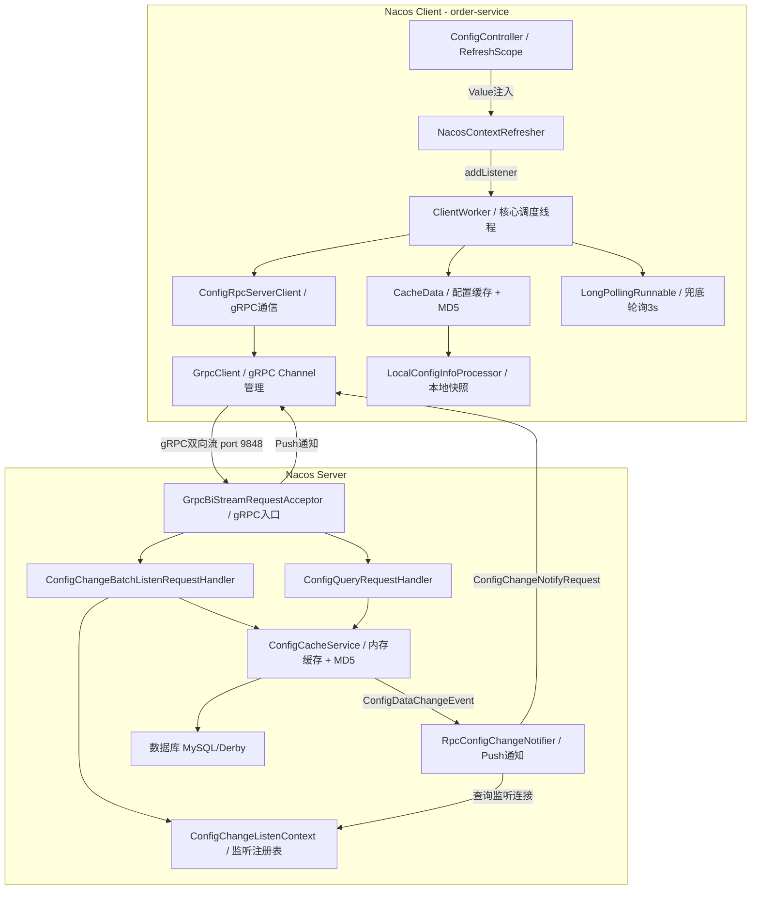
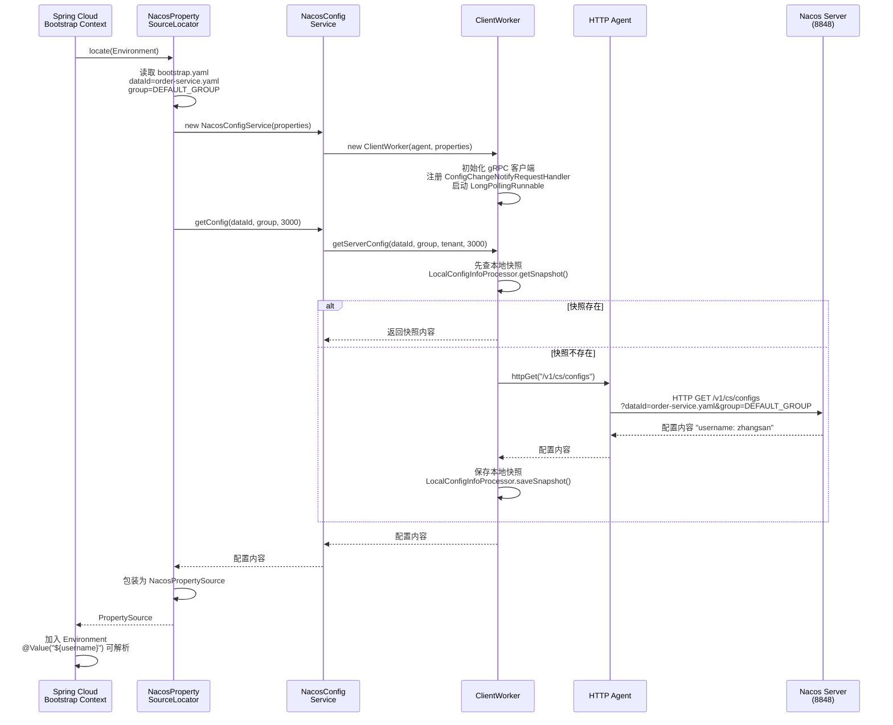
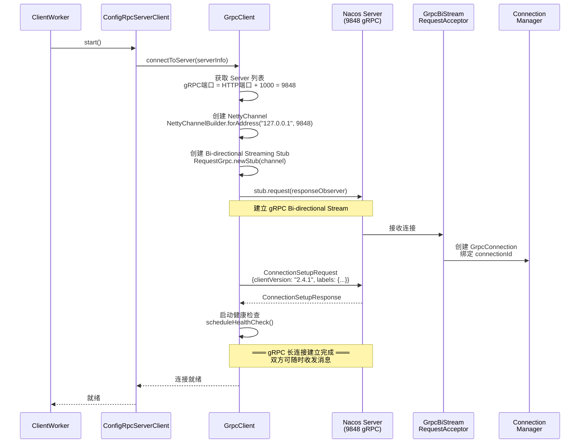
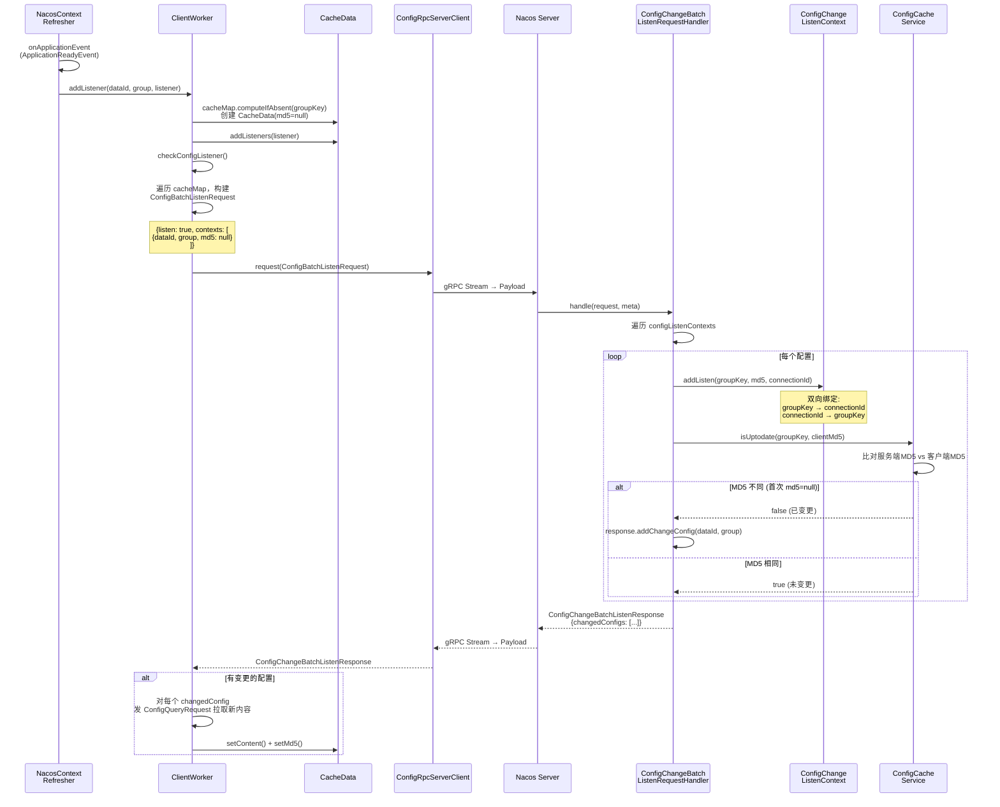
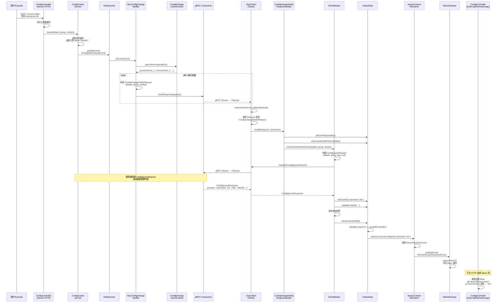
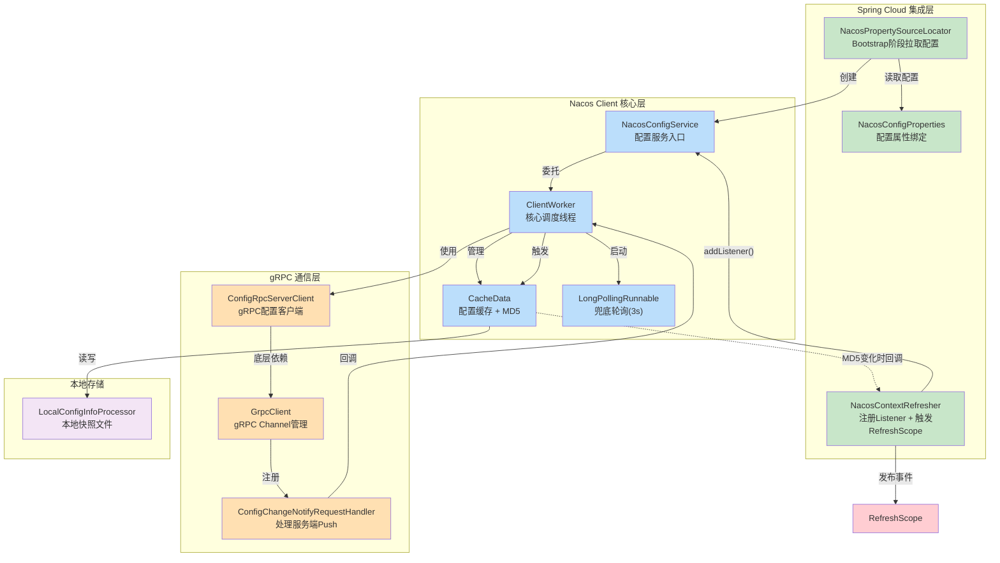
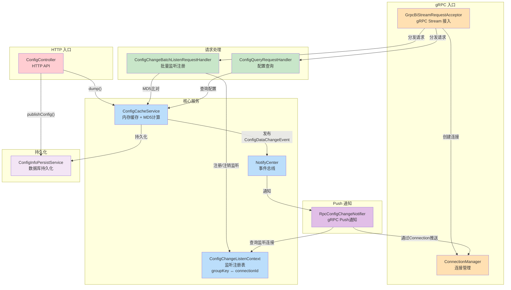
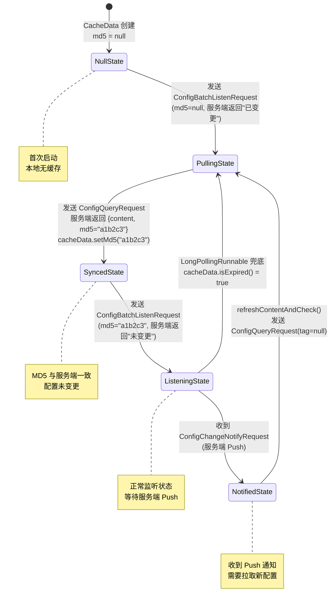

# Nacos 2.4.1 配置动态刷新原理全流程分析

> 基于 Spring Cloud Alibaba 2021.0.6.0 + Nacos Client 2.4.1 + Spring Boot 2.6.13

---

## 目录

1. [项目依赖关系梳理](#一项目依赖关系梳理)
2. [阶段一：Bootstrap 上下文初始化](#二阶段一bootstrap-上下文初始化)
3. [阶段二：拉取初始配置](#三阶段二拉取初始配置)
4. [阶段三：建立 gRPC 长连接](#四阶段三建立-grpc-长连接)
5. [阶段四：批量注册配置监听](#五阶段四批量注册配置监听)
6. [阶段五：配置变更 — 服务端 Push](#六阶段五配置变更--服务端-push)
7. [阶段六：客户端接收 Push → 拉取新配置 → Spring 刷新](#七阶段六客户端接收-push--拉取新配置--spring-刷新)
8. [阶段七：兜底机制 — LongPollingRunnable](#八阶段七兜底机制--longpollingrunnable)
9. [完整时序图](#九完整时序图)
10. [当前代码问题与修复](#十当前代码问题与修复)
11. [核心机制总结](#十一核心机制总结)
12. [流程图](#十二流程图)
    - [12.1 整体架构图](#121-整体架构图)
    - [12.2 启动与配置拉取流程](#122-启动与配置拉取流程)
    - [12.3 gRPC 连接建立流程](#123-grpc-连接建立流程)
    - [12.4 批量监听注册流程](#124-批量监听注册流程)
    - [12.5 配置变更 Push 全流程](#125-配置变更-push-全流程)
    - [12.6 客户端类调用关系图](#126-客户端类调用关系图)
    - [12.7 服务端类调用关系图](#127-服务端类调用关系图)
    - [12.8 MD5 生命周期状态图](#128-md5-生命周期状态图)
    - [12.9 配置变更端到端数据流](#129-配置变更端到端数据流)

---

## 一、项目依赖关系梳理

### 1.1 依赖层次

```
spring-cloud-starter-alibaba-nacos-config  (Spring Cloud 集成层)
  ├── NacosPropertySourceLocator   → Bootstrap 阶段拉取配置
  ├── NacosContextRefresher        → 注册 Listener，触发 RefreshScope
  └── NacosConfigBootstrapConfiguration → 自动配置

nacos-client 2.4.1  (Nacos 原生客户端)
  ├── NacosConfigService           → 配置服务入口
  ├── ClientWorker                 → 核心调度线程
  ├── ConfigRpcServerClient        → gRPC 通信客户端
  ├── CacheData                    → 配置缓存 + MD5 管理
  └── RpcClient / GrpcClient       → gRPC 连接管理
```

### 1.2 Nacos 2.x vs 1.x 通信架构对比

| 维度 | Nacos 1.x | Nacos 2.4.1 |
|---|---|---|
| 通信协议 | HTTP | **gRPC** |
| 监听方式 | 客户端轮询（HTTP 长轮询 30s） | **服务端主动 Push** |
| 连接模型 | 每次轮询新建 HTTP 连接 | **单条 gRPC 长连接复用** |
| 实时性 | 最多延迟 30s | **近乎实时** |
| 服务端压力 | 大量挂起连接 | 仅维护 gRPC Stream |
| 端口 | 8848 (HTTP) | 8848 (HTTP) + **9848 (gRPC)** |

---

## 二、阶段一：Bootstrap 上下文初始化

### 2.1 为什么是 bootstrap.yaml

项目引入了 `spring-cloud-starter-bootstrap` 依赖，启用了 **Bootstrap 上下文**。Spring Cloud 应用启动时会先创建 Bootstrap ApplicationContext，再创建主 ApplicationContext。Nacos 配置必须在 Bootstrap 阶段加载，因为后续 Bean 的 `@Value` 注入依赖这些配置。

```yaml
# bootstrap.yaml
spring:
  cloud:
    nacos:
      server-addr: 127.0.0.1:8848    # Nacos 服务端地址
      config:
        file-extension: yaml          # 配置格式
        prefix: ${spring.application.name}  # → order-service
  application:
    name: order-service
server:
  port: 8080
```

最终拼接出的 dataId 为：**`order-service.yaml`**（`prefix.file-extension`），group 默认为 **`DEFAULT_GROUP`**。

### 2.2 NacosConfigBootstrapConfiguration 自动装配

`spring-cloud-starter-alibaba-nacos-config` 通过 `spring.factories` 注册了自动配置类：

```java
// NacosConfigBootstrapConfiguration.java
@Configuration
@ConditionalOnProperty(name = "spring.cloud.nacos.config.enabled", matchIfMissing = true)
public class NacosConfigBootstrapConfiguration {

    @Bean
    public NacosPropertySourceLocator nacosPropertySourceLocator() {
        return new NacosPropertySourceLocator();
    }

    @Bean
    public NacosConfigProperties nacosConfigProperties() {
        return new NacosConfigProperties();
    }
}
```

`NacosPropertySourceLocator` 实现了 `PropertySourceLocator` 接口，在 Bootstrap 阶段被 `PropertySourceBootstrapConfiguration` 调用。

---

## 三、阶段二：拉取初始配置

### 3.1 调用入口

```java
// PropertySourceBootstrapConfiguration.java (Spring Cloud)
// 在 Bootstrap Context 的 prepareContext 阶段调用
for (PropertySourceLocator locator : propertySourceLocators) {
    PropertySource<?> source = locator.locate(environment);
    // 将 source 加入 Environment
}
```

### 3.2 NacosPropertySourceLocator.locate()

```java
// NacosPropertySourceLocator.java
@Override
public PropertySource<?> locate(Environment env) {
    NacosConfigProperties properties = nacosConfigProperties;

    // 1. 从 bootstrap.yaml 读取配置
    String dataId = properties.getPrefix() + "." + properties.getFileExtension();
    // → "order-service.yaml"
    String group = properties.getGroup();
    // → "DEFAULT_GROUP"
    String serverAddr = properties.getServerAddr();
    // → "127.0.0.1:8848"

    // 2. 创建 NacosConfigService（客户端核心对象）
    NacosConfigService configService = new NacosConfigService(
        buildProperties(serverAddr)
    );

    // 3. 拉取配置内容
    String config = configService.getConfig(dataId, group, 3000);

    // 4. 包装为 NacosPropertySource
    NacosPropertySource propertySource = new NacosPropertySource(
        dataId, group, config
    );

    // 5. 将 PropertySource 加入 Spring Environment
    //    此时 @Value("${username}") 就能解析到值了
    return propertySource;
}
```

### 3.3 NacosConfigService.getConfig() 内部

```java
// NacosConfigService.java
public String getConfig(String dataId, String group, long timeoutMs) {
    // 委托给 ClientWorker
    return worker.getServerConfig(dataId, group, tenant, timeoutMs);
}

// ClientWorker.java
public String getServerConfig(String dataId, String group, String tenant, long readTimeout) {
    // 1. 先查本地快照
    String snapshot = LocalConfigInfoProcessor.getSnapshot(
        name, dataId, group, tenant
    );
    if (snapshot != null) {
        return snapshot;
    }

    // 2. 快照不存在，通过 HTTP 拉取
    //    注意：首次获取配置仍走 HTTP，gRPC 连接尚未建立
    HttpResult result = agent.httpGet(
        "/v1/cs/configs",
        "dataId=" + dataId + "&group=" + group + "&tenant=" + tenant,
        readTimeout
    );

    // 3. 写入本地快照
    LocalConfigInfoProcessor.saveSnapshot(name, dataId, group, tenant, content);

    return content;
}
```

**关键点**：首次拉取配置走的是 HTTP 协议（`/v1/cs/configs`），因为此时 gRPC 连接还没建立。配置内容会被保存到本地快照文件，路径类似：

```
${user.home}/nacos/config/fixed-127.0.0.1_8848-DEFAULT_GROUP/order-service.yaml
```

---

## 四、阶段三：建立 gRPC 长连接

### 4.1 NacosConfigService 构造函数中的 gRPC 初始化

```java
// NacosConfigService.java 构造函数
public NacosConfigService(Properties properties) {
    // ...
    this.worker = new ClientWorker(this.agent, configFilterChainManager, properties);
    // ClientWorker 构造函数中会初始化 gRPC 客户端
}
```

### 4.2 ClientWorker 初始化 gRPC

```java
// ClientWorker.java
public ClientWorker(...) {
    // 1. 创建 gRPC 客户端
    this.rpcClient = RpcClientFactory.createClient(
        "config-" + name,          // clientName
        ConnectionType.GRPC,       // 连接类型
        labels                     // 包含 namespace 等标签
    );

    // 2. 注册服务端请求处理器（处理服务端 Push）
    this.rpcClient.registerServerRequestHandler(
        new ConfigChangeNotifyRequestHandler()  // 处理 Push 通知
    );

    // 3. 启动 gRPC 客户端，建立连接
    this.rpcClient.start();

    // 4. 启动本地兜底轮询线程（3秒间隔）
    this.executor.scheduleWithFixedDelay(
        new LongPollingRunnable(), 0, 3000, TimeUnit.MILLISECONDS
    );
}
```

### 4.3 RpcClient.start() — 建立 gRPC 连接

```java
// GrpcClient.java (RpcClient 的 gRPC 实现)
public void start() {
    // 1. 获取 Nacos Server 列表
    //    通过 HTTP GET /v1/cs/configs 或 naming 服务发现
    List<String> serverList = serverListFactory.getServerList();

    // 2. 选择一台 Server 建立连接
    //    gRPC 端口 = HTTP 端口 + 1000 = 8848 + 1000 = 9848
    ServerInfo serverInfo = new ServerInfo("127.0.0.1", 9848);

    // 3. 创建 Netty gRPC Channel
    ManagedChannel channel = NettyChannelBuilder
        .forAddress("127.0.0.1", 9848)
        .usePlaintext()
        .keepAliveTime(10, TimeUnit.SECONDS)
        .keepAliveTimeout(3, TimeUnit.SECONDS)
        .build();

    // 4. 创建 Bi-directional Streaming Stub
    RequestGrpc.RequestStub stub = RequestGrpc.newStub(channel);

    // 5. 建立双向流
    StreamObserver<Payload> requestStream = stub.request(
        new StreamObserver<Payload>() {
            @Override
            public void onNext(Payload payload) {
                // 收到服务端发来的消息（Push 通知）
                Request request = GrpcUtils.parse(payload);
                // 分发给注册的 ServerRequestHandler
                ServerRequestHandler handler = handlerMap.get(request.getType());
                handler.handle(request, connection);
            }

            @Override
            public void onError(Throwable t) {
                // 连接断开，触发重连
                reconnect();
            }

            @Override
            public void onCompleted() {
                // 服务端主动关闭
            }
        }
    );

    // 6. 发送连接注册请求
    ConnectionSetupRequest setupReq = new ConnectionSetupRequest();
    setupReq.setClientVersion("2.4.1");
    setupReq.setLabels(labels);  // namespace, appName 等
    requestStream.onNext(GrpcUtils.convert(setupReq));

    // 7. 启动健康检查（定时发送 HealthCheckRequest）
    scheduleHealthCheck();
}
```

**此时，客户端和服务端之间建立了一条持久的 gRPC 双向流连接。**

### 4.4 服务端 gRPC 请求入口

```java
// GrpcBiStreamRequestAcceptor.java
public class GrpcBiStreamRequestAcceptor extends RequestGrpc.RequestImplBase {

    @Override
    public StreamObserver<Payload> request(StreamObserver<Payload> responseObserver) {
        // 每个客户端连接创建一个 Connection 对象
        Connection connection = new GrpcConnection(serverInfo, responseObserver);

        return new StreamObserver<Payload>() {
            @Override
            public void onNext(Payload payload) {
                // 收到客户端消息
                Request request = GrpcUtils.parse(payload);
                RequestHandler handler = requestHandlerRegistry.get(request.getType());

                if (handler != null) {
                    // 分发到对应的 Handler
                    Response response = handler.handle(request, connection);
                    responseObserver.onNext(GrpcUtils.convert(response));
                }
            }

            @Override
            public void onError(Throwable t) {
                // 连接断开，清理监听注册
                connectionManager.unregister(connection.getConnectionId());
            }

            @Override
            public void onCompleted() {
                // 客户端主动关闭
            }
        };
    }
}
```

---

## 五、阶段四：批量注册配置监听

### 5.1 NacosContextRefresher 注册 Listener

应用启动完成后，`NacosContextRefresher` 监听 `ApplicationReadyEvent`，开始注册配置监听：

```java
// NacosContextRefresher.java
@Override
public void onApplicationEvent(ApplicationReadyEvent event) {
    // 遍历所有 NacosPropertySource
    for (NacosPropertySource propertySource : nacosPropertySources) {
        String dataId = propertySource.getDataId();   // "order-service.yaml"
        String group = propertySource.getGroup();     // "DEFAULT_GROUP"

        // 注册 Nacos Listener
        configService.addListener(dataId, group, new AbstractListener() {
            @Override
            public void receiveConfigInfo(String configInfo) {
                // 配置变更时触发
                // 1. 更新 Environment 中的 PropertySource
                // 2. 发布 RefreshScopeRefreshedEvent
                applicationContext.publishEvent(
                    new RefreshScopeRefreshedEvent("nacos")
                );
            }
        });
    }
}
```

### 5.2 ClientWorker.addTenantListeners()

```java
// ClientWorker.java
public void addTenantListeners(String dataId, String group, List<Listener> listeners) {
    String groupKey = GroupKey.getKey(dataId, group, tenant);
    // → "order-service.yaml+DEFAULT_GROUP"

    // 1. 获取或创建 CacheData
    CacheData cache = cacheMap.computeIfAbsent(groupKey,
        k -> new CacheData(dataId, group, tenant));

    // 2. 注册 Listener 到 CacheData
    cache.addListeners(listeners);

    // 3. 触发批量监听注册
    checkConfigListener();
}
```

### 5.3 CacheData 结构

```java
// CacheData.java — 配置缓存的核心数据结构
public class CacheData {
    private String dataId;
    private String group;
    private String tenant;

    // 配置内容
    private volatile String content;

    // MD5 值，用于快速比对（由服务端计算并返回）
    private volatile String md5;

    // 是否正在使用（有监听器）
    private volatile boolean isUseLocalConfig = false;

    // 注册的监听器列表
    private final CopyOnWriteArrayList<ManagerListenerWrap> listeners;

    // 是否与服务端一致
    private volatile boolean isConsistentWithServer = true;

    public void checkListenerMd5() {
        // 遍历所有 listener，如果 MD5 变化则回调
        for (ManagerListenerWrap wrap : listeners) {
            if (!md5.equals(wrap.lastCallMd5)) {
                wrap.lastCallMd5 = md5;
                wrap.listener.receiveConfigInfo(content);
            }
        }
    }
}
```

### 5.4 构建 ConfigBatchListenRequest

```java
// ClientWorker.java
private void checkConfigListener() {
    // 收集所有需要监听的配置
    ConfigBatchListenRequest request = new ConfigBatchListenRequest();
    request.setListen(true);  // 注册模式

    for (CacheData cacheData : cacheMap.values()) {
        ConfigListenContext ctx = new ConfigListenContext();
        ctx.setDataId(cacheData.getDataId());     // "order-service.yaml"
        ctx.setGroup(cacheData.getGroup());       // "DEFAULT_GROUP"
        ctx.setTenant(cacheData.getTenant());     // ""
        ctx.setMd5(cacheData.getMd5());           // 当前缓存的 MD5
        request.addConfigListenContext(ctx);
    }

    // 通过 gRPC 发送
    rpcClient.request(request);
}
```

### 5.5 服务端 ConfigChangeBatchListenRequestHandler 处理

```java
// ConfigChangeBatchListenRequestHandler.java
@Component
public class ConfigChangeBatchListenRequestHandler
        extends RequestHandler<ConfigBatchListenRequest, ConfigChangeBatchListenResponse> {

    @Autowired
    private ConfigChangeListenContext configChangeListenContext;

    @Override
    public ConfigChangeBatchListenResponse handle(
            ConfigBatchListenRequest configChangeListenRequest, RequestMeta meta)
            throws NacosException {

        String connectionId = meta.getConnectionId();
        String tag = configChangeListenRequest.getHeader(Constants.VIPSERVER_TAG);

        ConfigChangeBatchListenResponse response = new ConfigChangeBatchListenResponse();

        for (ConfigBatchListenRequest.ConfigListenContext listenContext :
                configChangeListenRequest.getConfigListenContexts()) {

            String groupKey = GroupKey2.getKey(
                listenContext.getDataId(), listenContext.getGroup(), listenContext.getTenant());
            String md5 = listenContext.getMd5();

            if (configChangeListenRequest.isListen()) {
                // ① 注册监听：绑定 groupKey ↔ connectionId
                configChangeListenContext.addListen(groupKey, md5, connectionId);

                // ② 比对 MD5：服务端当前 MD5 vs 客户端传来的 MD5
                boolean isUptoDate = ConfigCacheService.isUptodate(
                    groupKey, md5, meta.getClientIp(), tag);

                // ③ 如果 MD5 不同 → 配置已变更 → 立即告知客户端
                if (!isUptoDate) {
                    response.addChangeConfig(
                        listenContext.getDataId(), listenContext.getGroup(),
                        listenContext.getTenant());
                }
            } else {
                // 注销监听
                configChangeListenContext.removeListen(groupKey, connectionId);
            }
        }

        return response;
    }
}
```

### 5.6 ConfigChangeListenContext — 双向绑定

```java
// ConfigChangeListenContext.java
public class ConfigChangeListenContext {
    // groupKey → 监听该配置的所有 connectionId 集合
    private ConcurrentHashMap<String, Set<String>> configListenMap;

    // connectionId → 该连接监听的所有 groupKey 集合
    private ConcurrentHashMap<String, Set<String>> connectionListenMap;

    public void addListen(String groupKey, String md5, String connectionId) {
        // 正向：配置 → 连接
        configListenMap
            .computeIfAbsent(groupKey, k -> new ConcurrentHashSet<>())
            .add(connectionId);

        // 反向：连接 → 配置（用于连接断开时清理）
        connectionListenMap
            .computeIfAbsent(connectionId, k -> new ConcurrentHashSet<>())
            .add(groupKey);
    }

    // 连接断开时清理
    public void removeConnection(String connectionId) {
        Set<String> configKeys = connectionListenMap.remove(connectionId);
        if (configKeys != null) {
            configKeys.forEach(key -> {
                Set<String> conns = configListenMap.get(key);
                if (conns != null) conns.remove(connectionId);
            });
        }
    }
}
```

### 5.7 客户端 MD5 的来源

**MD5 始终由服务端计算，客户端只负责存储和回传。**

```
时间线：

① 启动，CacheData 创建
   md5 = null
   │
   ├──→ ConfigBatchListenRequest { md5: null }
   │    服务端 isUptodate("groupKey", null) → false → 返回"已变更"
   │
   ├──→ ConfigQueryRequest (拉取配置)
   │    服务端返回 { content: "username=zhangsan", md5: "a1b2c3..." }
   │
   ├──→ cacheData.setContent("username=zhangsan")
   │    cacheData.setMd5("a1b2c3...")          ← 来自服务端
   │
   ├──→ ConfigBatchListenRequest { md5: "a1b2c3..." }
   │    服务端 isUptodate("groupKey", "a1b2c3...") → true → 不返回变更
   │    (正常监听中...)
   │
   │    ╔══════ 用户在控制台修改配置为 username=lisi ══════╗
   │
   ├←── 收到 ConfigChangeNotifyRequest (Push)
   │
   ├──→ ConfigQueryRequest (拉取新配置)
   │    服务端返回 { content: "username=lisi", md5: "d4e5f6..." }
   │
   ├──→ cacheData.setContent("username=lisi")
   │    cacheData.setMd5("d4e5f6...")          ← 更新为新 MD5
   │
   ├──→ ConfigBatchListenRequest { md5: "d4e5f6..." }
   │    服务端 isUptodate("groupKey", "d4e5f6...") → true → 不返回变更
```

---

## 六、阶段五：配置变更 — 服务端 Push

### 6.1 用户在 Nacos 控制台修改配置

用户修改 `order-service.yaml` 中的 `username` 值并发布：

```
Nacos Console → POST /v1/cs/configs
  {
    dataId: "order-service.yaml",
    group: "DEFAULT_GROUP",
    content: "username: new_value"
  }
```

### 6.2 服务端处理发布

```java
// ConfigController.java (服务端)
@PostMapping("/configs")
public Boolean publishConfig(...) {
    // 1. 持久化到数据库（MySQL / Derby）
    configInfoPersistService.insertOrUpdate(dataId, group, content, ...);

    // 2. 更新内存缓存 + 触发变更事件
    ConfigCacheService.dump(dataId, group, tenant, content, ...);

    return true;
}

// ConfigCacheService.java
public static boolean dump(String dataId, String group, String tenant,
                            String content, long lastModifiedTs, String type) {
    String groupKey = GroupKey2.getKey(dataId, group, tenant);

    // 1. 更新内存缓存
    CacheItem cacheItem = CACHE.get(groupKey);
    cacheItem.setContent(content);
    cacheItem.setMd5(MD5Utils.md5Hex(content, "UTF-8"));  // 重新计算 MD5

    // 2. 发布 ConfigDataChangeEvent
    NotifyCenter.publishEvent(
        new ConfigDataChangeEvent(dataId, group, tenant, lastModifiedTs)
    );

    return true;
}
```

### 6.3 RpcConfigChangeNotifier — 通过 gRPC Push

```java
// RpcConfigChangeNotifier.java
public class RpcConfigChangeNotifier extends Subscriber<ConfigDataChangeEvent> {

    @Override
    public void onEvent(ConfigDataChangeEvent event) {
        String groupKey = GroupKey2.getKey(
            event.getDataId(), event.getGroup(), event.getTenant()
        );

        // 1. 从 ConfigChangeListenContext 获取所有监听该配置的连接
        Set<String> connectionIds = configChangeListenContext
            .getListeners(groupKey);

        if (connectionIds == null || connectionIds.isEmpty()) {
            return;  // 没有客户端监听，无需推送
        }

        // 2. 构造 Push 通知
        ConfigChangeNotifyRequest notifyRequest = new ConfigChangeNotifyRequest();
        notifyRequest.setDataId(event.getDataId());
        notifyRequest.setGroup(event.getGroup());
        notifyRequest.setTenant(event.getTenant());

        Payload payload = GrpcUtils.convert(notifyRequest);

        // 3. 遍历所有监听连接，通过 gRPC Stream 推送
        for (String connectionId : connectionIds) {
            Connection connection = connectionManager.getConnection(connectionId);
            if (connection != null) {
                // 通过 Bi-directional Stream 的 responseObserver 发送
                connection.sendResponse(payload);
            } else {
                // 连接已失效，清理
                configChangeListenContext.removeConnection(connectionId);
            }
        }
    }
}
```

---

## 七、阶段六：客户端接收 Push → 拉取新配置 → Spring 刷新

### 7.1 客户端接收 Push 通知

```java
// GrpcClient 中 Bi-stream 的 responseObserver
new StreamObserver<Payload>() {
    @Override
    public void onNext(Payload payload) {
        Request request = GrpcUtils.parse(payload);

        // 分发到对应的 ServerRequestHandler
        // 类型为 ConfigChangeNotifyRequest → ConfigChangeNotifyRequestHandler
        ServerRequestHandler handler = handlerMap.get(request.getType());
        handler.handle(request, connection);
    }
}
```

### 7.2 ConfigChangeNotifyRequestHandler 处理

```java
// ConfigChangeNotifyRequestHandler.java (客户端侧)
public class ConfigChangeNotifyRequestHandler
        implements ServerRequestHandler<ConfigChangeNotifyRequest> {

    @Override
    public Response handle(ConfigChangeNotifyRequest request, Connection connection) {
        String dataId = request.getDataId();   // "order-service.yaml"
        String group = request.getGroup();     // "DEFAULT_GROUP"
        String tenant = request.getTenant();   // ""

        // 1. 获取对应的 CacheData
        String groupKey = GroupKey.getKey(dataId, group, tenant);
        CacheData cacheData = clientWorker.getCache(groupKey);

        if (cacheData != null) {
            // 2. 标记为不一致（需要刷新）
            cacheData.setConsistentWithServer(false);

            // 3. 触发拉取最新配置
            clientWorker.refreshContentAndCheck(dataId, group, tenant);
        }

        // 4. 返回 ACK
        ConfigChangeNotifyResponse response = new ConfigChangeNotifyResponse();
        response.setResultCode(ResponseCode.SUCCESS);
        return response;
    }
}
```

### 7.3 ClientWorker.refreshContentAndCheck() — 拉取新配置

```java
// ClientWorker.java
public void refreshContentAndCheck(String dataId, String group, String tenant) {
    CacheData cacheData = getCache(dataId, group, tenant);
    if (cacheData == null) return;

    // 1. 通过 gRPC 发送 ConfigQueryRequest（不带 tag，强制拉取）
    ConfigQueryRequest request = new ConfigQueryRequest();
    request.setDataId(dataId);
    request.setGroup(group);
    request.setTenant(tenant);
    request.setTag(null);  // 不传 MD5，表示强制获取最新

    ConfigQueryResponse response = rpcClient.request(request, 3000);

    // 2. 获取新配置内容 + 新 MD5
    String newContent = response.getContent();
    String newMd5 = response.getMd5();

    // 3. 更新 CacheData
    String oldMd5 = cacheData.getMd5();
    cacheData.setContent(newContent);
    cacheData.setMd5(newMd5);

    // 4. 保存到本地快照
    LocalConfigInfoProcessor.saveSnapshot(
        name, dataId, group, tenant, newContent
    );

    // 5. MD5 确实变化了 → 触发 Listener 回调
    if (!Objects.equals(oldMd5, newMd5)) {
        cacheData.checkListenerMd5();
    }
}
```

### 7.4 CacheData.checkListenerMd5() — 回调所有 Listener

```java
// CacheData.java
public void checkListenerMd5() {
    for (ManagerListenerWrap wrap : listeners) {
        if (!md5.equals(wrap.lastCallMd5)) {
            wrap.lastCallMd5 = md5;

            // 在线程池中异步执行回调
            listenerExecutor.execute(() -> {
                wrap.listener.receiveConfigInfo(content);
            });
        }
    }
}
```

### 7.5 NacosContextRefresher.receiveConfigInfo() — 触发 Spring 刷新

```java
// NacosContextRefresher 中注册的 Listener
new AbstractListener() {
    @Override
    public void receiveConfigInfo(String configInfo) {
        // configInfo = "username: new_value\n..."

        // 1. 解析新配置内容，更新 NacosPropertySource
        Map<String, Object> newConfig = parseYaml(configInfo);
        nacosPropertySource.setSource(newConfig);

        // 2. 发布 RefreshScopeRefreshedEvent
        applicationContext.publishEvent(
            new RefreshScopeRefreshedEvent("nacos-config-refresh")
        );
    }
}
```

### 7.6 RefreshScope 处理 — Bean 重建

```java
// RefreshScope.java (Spring Cloud)
public class RefreshScope extends GenericScope {

    @Override
    public void onApplicationEvent(RefreshScopeRefreshedEvent event) {
        // 1. 清空 RefreshScope 的 Bean 缓存
        super.destroy();

        // 2. 下次访问 @RefreshScope Bean 时
        //    getBean() → 缓存为空 → 重新创建 Bean
        //    重新创建时 @Value 从 Environment 读取最新值
    }
}
```

---

## 八、阶段七：兜底机制 — LongPollingRunnable

虽然 2.x 以 gRPC Push 为主，但 `ClientWorker` 仍保留了一个定时轮询线程作为**兜底**：

```java
// ClientWorker.java 中每 3 秒执行一次
class LongPollingRunnable implements Runnable {
    @Override
    public void run() {
        for (CacheData cacheData : cacheMap.values()) {
            // 检查是否超过一定时间未收到服务端 Push
            if (cacheData.isExpired()) {
                // 主动拉取一次，防止 gRPC 连接异常导致配置不同步
                refreshContentAndCheck(
                    cacheData.dataId, cacheData.group, cacheData.tenant
                );
            }
        }
    }
}
```

---

## 九、完整时序图

```
Spring Boot 启动
  │
  ├─ ① Bootstrap Context 初始化
  │    NacosPropertySourceLocator.locate()
  │    ──── HTTP GET /v1/cs/configs?dataId=order-service.yaml ────→ Nacos Server
  │    ←─── 返回配置内容 "username: zhangsan" ─────────────────────
  │    配置写入 Environment → @Value("${username}") 可解析
  │
  ├─ ② 主 ApplicationContext 初始化
  │    ConfigController Bean 创建，@Value 注入 "zhangsan"
  │
  ├─ ③ NacosConfigService 构造 → ClientWorker 初始化
  │    ──── gRPC 连接建立 (127.0.0.1:9848) ──────────────────────→ Nacos Server
  │    ════════ Bi-directional Stream 建立 ═══════════════════════
  │
  ├─ ④ ApplicationReadyEvent → NacosContextRefresher 注册监听
  │    ──── ConfigBatchListenRequest ────────────────────────────→ Nacos Server
  │         { dataId: "order-service.yaml", md5: "a1b2c3..." }
  │    ←─── ConfigChangeBatchListenResponse ──────────────────────
  │         { changedConfigs: [] }  (MD5 相同，无变更)
  │
  │  ╔═══════════════ 正常运行，等待配置变更 ═══════════════════╗
  │
  │                          ⑤ 用户在 Nacos Console 修改 username=lisi 并发布
  │                             服务端：持久化 → 更新缓存 → 重新计算 MD5="d4e5f6..."
  │                             RpcConfigChangeNotifier 找到监听连接
  │
  │  ←─── ConfigChangeNotifyRequest ─────────────────────────────
  │       { dataId: "order-service.yaml", group: "DEFAULT_GROUP" }
  │
  │  ⑥ ConfigChangeNotifyRequestHandler 处理
  │     cacheData.setConsistentWithServer(false)
  │     clientWorker.refreshContentAndCheck()
  │
  │  ──── ConfigQueryRequest ────────────────────────────────────→ Nacos Server
  │       { dataId: "order-service.yaml", tag: null }
  │  ←─── ConfigQueryResponse ───────────────────────────────────
  │       { content: "username: lisi", md5: "d4e5f6..." }
  │
  │  ⑦ 更新 CacheData
  │     cacheData.setContent("username: lisi")
  │     cacheData.setMd5("d4e5f6...")
  │     cacheData.checkListenerMd5()
  │       → listener.receiveConfigInfo("username: lisi")
  │
  │  ⑧ NacosContextRefresher
  │     更新 NacosPropertySource
  │     publishEvent(RefreshScopeRefreshedEvent)
  │       → RefreshScope 清空缓存
  │       → 下次访问 ConfigController → 重新创建 Bean
  │       → @Value("${username}") → 从 Environment 读取 → "lisi"
  │
  │  ╚═══════════════ 继续等待下一次 Push ═══════════════════════╝
```

---

## 十、当前代码问题与修复

### 10.1 问题

当前 `ConfigController` 缺少 `@RefreshScope` 注解：

```java
@RestController
public class ConfigController {          // ← 没有 @RefreshScope

    @Value("${username:}")
    private String username;             // ← 只在 Bean 创建时注入一次

    @GetMapping("/demo")
    public String getConfig() {
        return username;
    }
}
```

`ConfigController` 是默认的单例 Bean，在应用启动时创建，`@Value` 注入发生在构造阶段。之后即使 `Environment` 中的配置被更新了，这个 Bean 不会重建，`username` 字段永远是启动时的值。

### 10.2 修复

```java
@RestController
@RefreshScope   // ← 加上这个
public class ConfigController {
    @Value("${username:}")
    private String username;

    @GetMapping("/demo")
    public String getConfig() {
        return username;
    }
}
```

加上 `@RefreshScope` 后，`ConfigController` 变成 Scope 为 `refresh` 的 Bean。当 `RefreshScopeRefreshedEvent` 发布时，`RefreshScope` 会清空缓存，下次请求 `/demo` 时会重新创建 `ConfigController`，此时 `@Value` 从已更新的 `Environment` 中读取到最新值。

---

## 十一、核心机制总结

| 环节 | 关键类 | 核心动作 |
|---|---|---|
| 拉取初始配置 | `NacosPropertySourceLocator` | HTTP GET `/v1/cs/configs` |
| 建立长连接 | `GrpcClient` | gRPC Bi-directional Stream (port 9848) |
| 批量注册监听 | `ClientWorker` → `ConfigChangeBatchListenRequestHandler` | 绑定 groupKey ↔ connectionId，MD5 比对 |
| 配置变更 Push | `RpcConfigChangeNotifier` | 遍历监听连接，通过 gRPC Stream 推送 |
| 拉取新配置 | `ClientWorker.refreshContentAndCheck()` | gRPC `ConfigQueryRequest` |
| MD5 比对 | `CacheData` | 新旧 MD5 不同才触发回调 |
| Spring 刷新 | `NacosContextRefresher` → `RefreshScope` | 发布 `RefreshScopeRefreshedEvent`，重建 `@RefreshScope` Bean |
| 兜底轮询 | `LongPollingRunnable` | 每 3 秒检查，防止 gRPC 断连导致不同步 |
| 本地快照 | `LocalConfigInfoProcessor` | 服务端不可用时仍能读取上次配置 |

---

## 十二、流程图

### 12.1 整体架构图



### 12.2 启动与配置拉取流程



### 12.3 gRPC 连接建立流程



### 12.4 批量监听注册流程



### 12.5 配置变更 Push 全流程



### 12.6 客户端类调用关系图



### 12.7 服务端类调用关系图



### 12.8 MD5 生命周期状态图



### 12.9 配置变更端到端数据流

```mermaid
flowchart LR
    subgraph A["1. 用户操作"]
        A1["Nacos Console<br/>修改配置"]
    end

    subgraph B["2. 服务端处理"]
        B1["ConfigController<br/>publishConfig()"]
        B2["DB 持久化"]
        B3["ConfigCacheService<br/>更新内存缓存<br/>重新计算MD5"]
        B4["NotifyCenter<br/>发布事件"]
    end

    subgraph C["3. Push 通知"]
        C1["RpcConfigChangeNotifier<br/>查找监听连接"]
        C2["ConfigChangeListenContext<br/>groupKey→connectionIds"]
        C3["gRPC Stream<br/>推送 ConfigChangeNotifyRequest"]
    end

    subgraph D["4. 客户端接收"]
        D1["GrpcClient<br/>responseObserver.onNext()"]
        D2["ConfigChangeNotifyRequestHandler<br/>标记不一致"]
        D3["ClientWorker<br/>refreshContentAndCheck()"]
    end

    subgraph E["5. 拉取新配置"]
        E1["ConfigQueryRequest<br/>(tag=null, 强制拉取)"]
        E2["服务端返回<br/>ConfigQueryResponse"]
        E3["CacheData<br/>setContent() + setMd5()"]
    end

    subgraph F["6. Spring 刷新"]
        F1["CacheData<br/>checkListenerMd5()"]
        F2["NacosContextRefresher<br/>更新PropertySource"]
        F3["RefreshScope<br/>清空Bean缓存"]
        F4["@RefreshScope Bean<br/>重新创建<br/>@Value 注入新值"]
    end

    A1 --> B1
    B1 --> B2
    B1 --> B3
    B3 --> B4
    B4 --> C1
    C1 --> C2
    C2 --> C3
    C3 --> D1
    D1 --> D2
    D2 --> D3
    D3 --> E1
    E1 --> E2
    E2 --> E3
    E3 --> F1
    F1 --> F2
    F2 --> F3
    F3 --> F4

    style A fill:#e8f5e9
    style B fill:#fff3e0
    style C fill:#fce4ec
    style D fill:#e3f2fd
    style E fill:#f3e5f5
    style F fill:#e0f2f1
```


