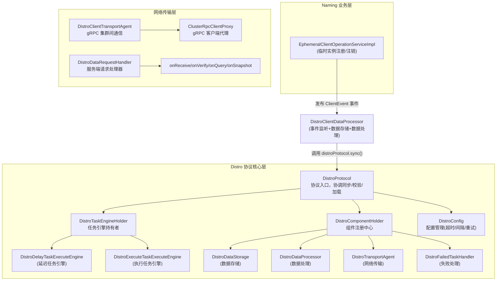
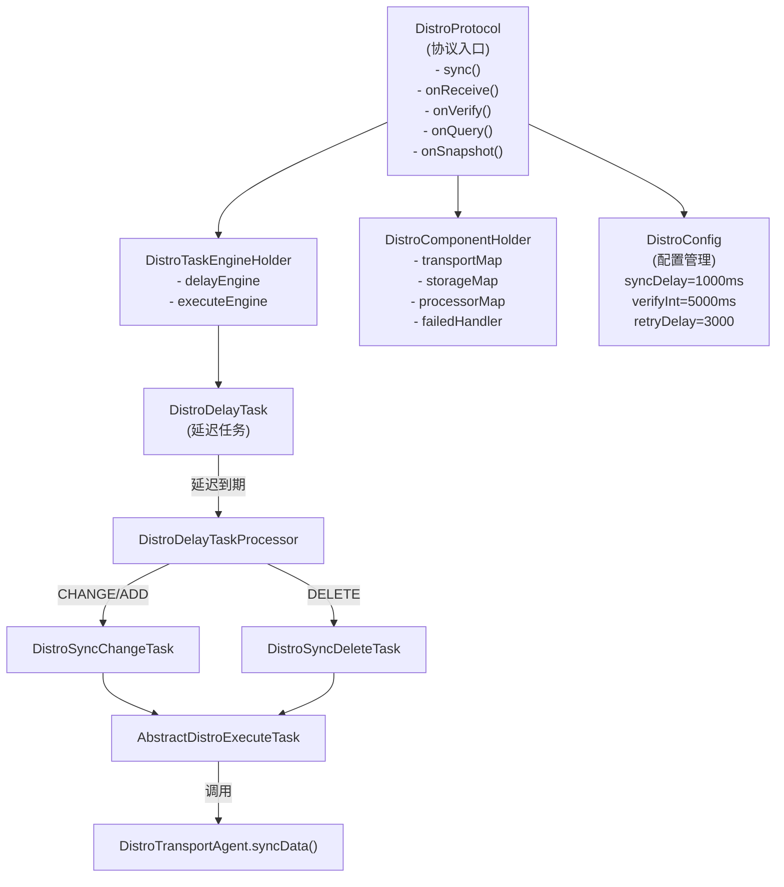
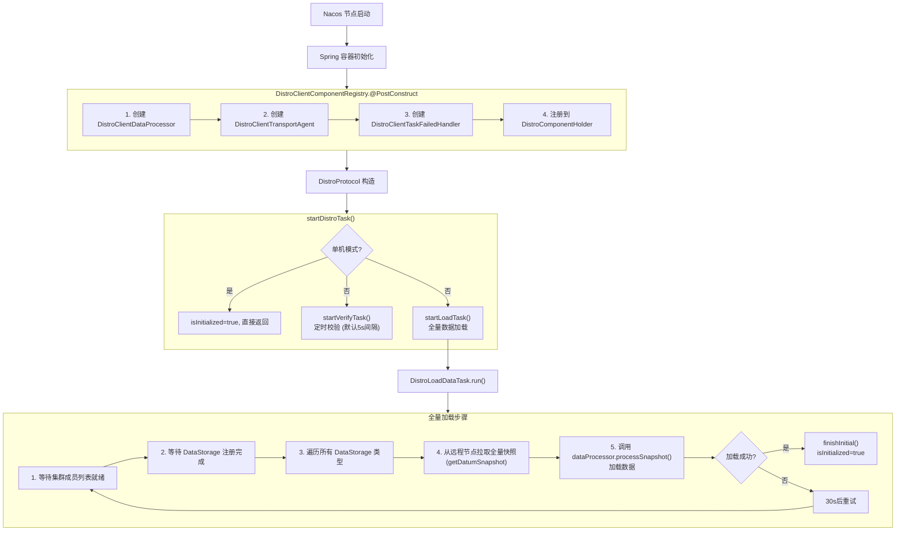
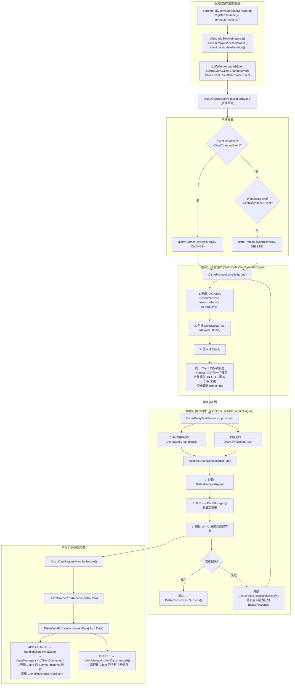
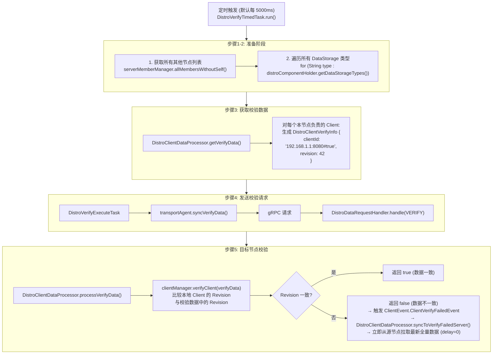

# Nacos AP 协议 (Distro) 深入源码分析

> 基于 Nacos 2.4.1 源码分析

---

## 一、Distro 协议概述

Distro 是 Nacos 自研的 **AP 协议**（最终一致性协议），用于 Naming 模块中**临时实例（Ephemeral Instance）**的集群间数据同步。其设计核心是：**优先保证可用性（Availability）和分区容错性（Partition Tolerance），允许短暂的数据不一致，通过异步同步和定时校验最终达到一致**。

### 1.1 核心设计理念

| 特性 | 说明 |
|------|------|
| 一致性模型 | 最终一致性 (Eventual Consistency) |
| 同步方式 | 异步三阶段：延迟合并 → 执行同步 → 定时校验 |
| 通信方式 | gRPC 双向流 (集群节点间) |
| 数据粒度 | 以 Client 为同步单元 |
| 故障处理 | 重试队列 + 失败回调 |

### 1.2 与 CP 协议 (JRaft) 的对比

| 维度 | Distro (AP) | JRaft (CP) |
|------|-------------|------------|
| 一致性 | 最终一致 | 强一致 |
| 可用性 | 高，任意节点可读写 | 仅 Leader 可写 |
| 适用数据 | 临时实例 | 持久化实例、元数据 |
| 同步时机 | 异步延迟同步 | 同步 Raft Log 复制 |
| 数据校验 | 定时反熵校验 | Raft 日志强一致 |

---

## 二、整体架构

### 2.1 架构层次图



### 2.2 核心类关系图



---

## 三、初始化流程

### 3.1 组件注册

Nacos 启动时，`DistroClientComponentRegistry` 通过 `@PostConstruct` 将 Naming 模块的四种组件注册到 Distro 框架中。

**源码位置**: [DistroClientComponentRegistry.java](file:///d:/workspace/java_projects/source_projects/nacos-2.4.1/naming/src/main/java/com/alibaba/nacos/naming/consistency/ephemeral/distro/v2/DistroClientComponentRegistry.java)

```java
@PostConstruct
public void doRegister() {
    // 1. 创建数据处理器（同时实现了 DistroDataStorage + DistroDataProcessor）
    DistroClientDataProcessor dataProcessor = new DistroClientDataProcessor(clientManager, distroProtocol);
    
    // 2. 创建传输代理（基于 gRPC 集群通信）
    DistroTransportAgent transportAgent = new DistroClientTransportAgent(clusterRpcClientProxy, serverMemberManager);
    
    // 3. 创建失败重试处理器
    DistroClientTaskFailedHandler taskFailedHandler = new DistroClientTaskFailedHandler(taskEngineHolder);
    
    // 4. 注册四种组件到 DistroComponentHolder
    componentHolder.registerDataStorage(DistroClientDataProcessor.TYPE, dataProcessor);
    componentHolder.registerDataProcessor(dataProcessor);
    componentHolder.registerTransportAgent(DistroClientDataProcessor.TYPE, transportAgent);
    componentHolder.registerFailedTaskHandler(DistroClientDataProcessor.TYPE, taskFailedHandler);
}
```

### 3.2 DistroProtocol 启动

`DistroProtocol` 构造函数中启动两个核心任务：

**源码位置**: [DistroProtocol.java](file:///d:/workspace/java_projects/source_projects/nacos-2.4.1/core/src/main/java/com/alibaba/nacos/core/distributed/distro/DistroProtocol.java#L58-L80)

```java
public DistroProtocol(...) {
    // ...
    startDistroTask();  // 启动 Distro 任务
}

private void startDistroTask() {
    if (EnvUtil.getStandaloneMode()) {
        isInitialized = true;  // 单机模式直接标记完成
        return;
    }
    startVerifyTask();  // 启动定时校验任务
    startLoadTask();    // 启动全量数据加载任务
}
```

### 3.3 初始化流程图



---

## 四、数据同步流程（核心）

Distro 的数据同步采用 **三阶段异步模型**：

```
阶段1: 延迟合并 (DistroDelayTask)
  → 阶段2: 执行同步 (DistroSyncChangeTask / DistroSyncDeleteTask)
    → 阶段3: 定时校验 (DistroVerifyTimedTask)
```

### 4.1 阶段一：延迟合并

**目的**：短时间内对同一 Client 的多次变更合并为一次同步，减少网络开销。

**源码位置**: [DistroProtocol.java](file:///d:/workspace/java_projects/source_projects/nacos-2.4.1/core/src/main/java/com/alibaba/nacos/core/distributed/distro/DistroProtocol.java#L105-L130)

```java
// 默认延迟 1000ms 同步
public void sync(DistroKey distroKey, DataOperation action) {
    sync(distroKey, action, DistroConfig.getInstance().getSyncDelayMillis());
}

// 向所有其他节点同步
public void sync(DistroKey distroKey, DataOperation action, long delay) {
    for (Member each : memberManager.allMembersWithoutSelf()) {
        syncToTarget(distroKey, action, each.getAddress(), delay);
    }
}

// 向指定目标节点同步
public void syncToTarget(DistroKey distroKey, DataOperation action, String targetServer, long delay) {
    DistroKey distroKeyWithTarget = new DistroKey(distroKey.getResourceKey(), 
        distroKey.getResourceType(), targetServer);
    DistroDelayTask distroDelayTask = new DistroDelayTask(distroKeyWithTarget, action, delay);
    distroTaskEngineHolder.getDelayTaskExecuteEngine().addTask(distroKeyWithTarget, distroDelayTask);
}
```

**任务合并逻辑**（[DistroDelayTask.java](file:///d:/workspace/java_projects/source_projects/nacos-2.4.1/core/src/main/java/com/alibaba/nacos/core/distributed/distro/task/delay/DistroDelayTask.java#L60-L71)）：

```java
@Override
public void merge(AbstractDelayTask task) {
    if (!(task instanceof DistroDelayTask)) {
        return;
    }
    DistroDelayTask oldTask = (DistroDelayTask) task;
    // 如果旧任务是 CHANGE 而新任务是 DELETE，以 DELETE 为准
    // 如果旧任务更早创建，保留旧任务的 createTime
    if (!action.equals(oldTask.getAction()) && createTime < oldTask.getCreateTime()) {
        action = oldTask.getAction();
        createTime = oldTask.getCreateTime();
    }
    setLastProcessTime(oldTask.getLastProcessTime());
}
```

### 4.2 阶段二：执行同步

延迟时间到达后，`DistroDelayTaskProcessor` 将延迟任务转换为执行任务。

**源码位置**: [DistroDelayTaskProcessor.java](file:///d:/workspace/java_projects/source_projects/nacos-2.4.1/core/src/main/java/com/alibaba/nacos/core/distributed/distro/task/delay/DistroDelayTaskProcessor.java#L43-L63)

```java
@Override
public boolean process(NacosTask task) {
    DistroDelayTask distroDelayTask = (DistroDelayTask) task;
    DistroKey distroKey = distroDelayTask.getDistroKey();
    switch (distroDelayTask.getAction()) {
        case DELETE:
            // 创建删除同步任务
            DistroSyncDeleteTask syncDeleteTask = new DistroSyncDeleteTask(distroKey, distroComponentHolder);
            distroTaskEngineHolder.getExecuteWorkersManager().addTask(distroKey, syncDeleteTask);
            return true;
        case CHANGE:
        case ADD:
            // 创建变更同步任务
            DistroSyncChangeTask syncChangeTask = new DistroSyncChangeTask(distroKey, distroComponentHolder);
            distroTaskEngineHolder.getExecuteWorkersManager().addTask(distroKey, syncChangeTask);
            return true;
        default:
            return false;
    }
}
```

#### DistroSyncChangeTask 执行逻辑

**源码位置**: [DistroSyncChangeTask.java](file:///d:/workspace/java_projects/source_projects/nacos-2.4.1/core/src/main/java/com/alibaba/nacos/core/distributed/distro/task/execute/DistroSyncChangeTask.java#L45-L65)

```java
@Override
protected boolean doExecute() {
    String type = getDistroKey().getResourceType();
    // 1. 从 DistroDataStorage 获取当前数据
    DistroData distroData = getDistroData(type);
    if (null == distroData) {
        return true;  // 数据不存在，跳过
    }
    // 2. 通过 TransportAgent 发送到目标节点
    return getDistroComponentHolder().findTransportAgent(type)
            .syncData(distroData, getDistroKey().getTargetServer());
}

private DistroData getDistroData(String type) {
    DistroData result = getDistroComponentHolder().findDataStorage(type).getDistroData(getDistroKey());
    if (null != result) {
        result.setType(OPERATION);  // 标记为 CHANGE 操作
    }
    return result;
}
```

#### AbstractDistroExecuteTask 执行框架

**源码位置**: [AbstractDistroExecuteTask.java](file:///d:/workspace/java_projects/source_projects/nacos-2.4.1/core/src/main/java/com/alibaba/nacos/core/distributed/distro/task/execute/AbstractDistroExecuteTask.java#L55-L80)

```java
@Override
public void run() {
    String type = getDistroKey().getResourceType();
    DistroTransportAgent transportAgent = distroComponentHolder.findTransportAgent(type);
    if (null == transportAgent) {
        return;
    }
    // 判断是否支持回调模式
    if (transportAgent.supportCallbackTransport()) {
        doExecuteWithCallback(new DistroExecuteCallback());
    } else {
        executeDistroTask();
    }
}

// 失败处理
protected void handleFailedTask() {
    String type = getDistroKey().getResourceType();
    DistroFailedTaskHandler failedTaskHandler = distroComponentHolder.findFailedTaskHandler(type);
    if (null == failedTaskHandler) {
        return;  // 没有失败处理器，丢弃
    }
    failedTaskHandler.retry(getDistroKey(), getDataOperation());  // 重新放入延迟队列
}
```

#### 失败重试

**源码位置**: [DistroClientTaskFailedHandler.java](file:///d:/workspace/java_projects/source_projects/nacos-2.4.1/naming/src/main/java/com/alibaba/nacos/naming/consistency/ephemeral/distro/v2/DistroClientTaskFailedHandler.java#L35-L43)

```java
@Override
public void retry(DistroKey distroKey, DataOperation action) {
    // 失败后延迟 3000ms 重新放入延迟队列
    DistroDelayTask retryTask = new DistroDelayTask(distroKey, action,
            DistroConfig.getInstance().getSyncRetryDelayMillis());
    distroTaskEngineHolder.getDelayTaskExecuteEngine().addTask(distroKey, retryTask);
}
```

### 4.3 阶段三：定时校验（反熵）

定时校验是 Distro 协议的**反熵（Anti-Entropy）机制**，用于修复因网络问题或节点故障导致的数据不一致。

**源码位置**: [DistroVerifyTimedTask.java](file:///d:/workspace/java_projects/source_projects/nacos-2.4.1/core/src/main/java/com/alibaba/nacos/core/distributed/distro/task/verify/DistroVerifyTimedTask.java#L55-L84)

```java
@Override
public void run() {
    List<Member> targetServer = serverMemberManager.allMembersWithoutSelf();
    // 遍历所有已注册的 DataStorage 类型
    for (String each : distroComponentHolder.getDataStorageTypes()) {
        verifyForDataStorage(each, targetServer);
    }
}

private void verifyForDataStorage(String type, List<Member> targetServer) {
    DistroDataStorage dataStorage = distroComponentHolder.findDataStorage(type);
    if (!dataStorage.isFinishInitial()) {
        return;  // 初始化未完成，不发送校验
    }
    // 获取校验数据（通常是 ClientId + Revision 摘要）
    List<DistroData> verifyData = dataStorage.getVerifyData();
    if (null == verifyData || verifyData.isEmpty()) {
        return;
    }
    // 向每个其他节点发送校验数据
    for (Member member : targetServer) {
        DistroTransportAgent agent = distroComponentHolder.findTransportAgent(type);
        if (null == agent) {
            continue;
        }
        executeTaskExecuteEngine.addTask(member.getAddress() + type,
                new DistroVerifyExecuteTask(agent, verifyData, member.getAddress(), type));
    }
}
```

**校验数据生成**（[DistroClientDataProcessor.java](file:///d:/workspace/java_projects/source_projects/nacos-2.4.1/naming/src/main/java/com/alibaba/nacos/naming/consistency/ephemeral/distro/v2/DistroClientDataProcessor.java#L270-L295)）：

```java
@Override
public List<DistroData> getVerifyData() {
    List<DistroData> result = null;
    for (String each : clientManager.allClientId()) {
        Client client = clientManager.getClient(each);
        if (null == client || !client.isEphemeral()) {
            continue;
        }
        // 只校验本节点负责的 Client
        if (clientManager.isResponsibleClient(client)) {
            // 生成校验信息：ClientId + Revision
            DistroClientVerifyInfo verifyData = new DistroClientVerifyInfo(
                client.getClientId(), client.getRevision());
            DistroKey distroKey = new DistroKey(client.getClientId(), TYPE);
            DistroData data = new DistroData(distroKey, 
                ApplicationUtils.getBean(Serializer.class).serialize(verifyData));
            data.setType(DataOperation.VERIFY);
            result.add(data);
        }
    }
    return result;
}
```

**校验接收处理**（[DistroClientDataProcessor.java](file:///d:/workspace/java_projects/source_projects/nacos-2.4.1/naming/src/main/java/com/alibaba/nacos/naming/consistency/ephemeral/distro/v2/DistroClientDataProcessor.java#L240-L250)）：

```java
@Override
public boolean processVerifyData(DistroData distroData, String sourceAddress) {
    DistroClientVerifyInfo verifyData = ApplicationUtils.getBean(Serializer.class)
            .deserialize(distroData.getContent(), DistroClientVerifyInfo.class);
    // 本地校验：比较 Revision
    if (clientManager.verifyClient(verifyData)) {
        return true;  // 数据一致
    }
    // 数据不一致，触发 ClientVerifyFailedEvent，从源节点重新拉取数据
    Loggers.DISTRO.info("client {} is invalid, get new client from {}", 
        verifyData.getClientId(), sourceAddress);
    return false;
}
```

### 4.4 数据同步完整流程图



---

## 五、定时校验流程（反熵）



---

## 六、网络传输层

### 6.1 TransportAgent 接口

**源码位置**: [DistroTransportAgent.java](file:///d:/workspace/java_projects/source_projects/nacos-2.4.1/core/src/main/java/com/alibaba/nacos/core/distributed/distro/component/DistroTransportAgent.java)

```java
public interface DistroTransportAgent {
    boolean supportCallbackTransport();      // 是否支持回调
    boolean syncData(DistroData data, String targetServer);                    // 同步数据
    void syncData(DistroData data, String targetServer, DistroCallback cb);    // 异步同步
    boolean syncVerifyData(DistroData verifyData, String targetServer);        // 同步校验
    void syncVerifyData(DistroData verifyData, String targetServer, DistroCallback cb); // 异步校验
    DistroData getData(DistroKey key, String targetServer);                    // 获取单条数据
    DistroData getDatumSnapshot(String targetServer);                          // 获取全量快照
}
```

### 6.2 Naming 模块实现

**源码位置**: [DistroClientTransportAgent.java](file:///d:/workspace/java_projects/source_projects/nacos-2.4.1/naming/src/main/java/com/alibaba/nacos/naming/consistency/ephemeral/distro/v2/DistroClientTransportAgent.java)

```java
// 基于 gRPC 的集群间通信实现
@Override
public boolean syncData(DistroData data, String targetServer) {
    if (isNoExistTarget(targetServer)) {
        return true;  // 目标节点不存在，直接返回成功
    }
    DistroDataRequest request = new DistroDataRequest(data, data.getType());
    Member member = memberManager.find(targetServer);
    if (checkTargetServerStatusUnhealthy(member)) {
        return false;  // 目标节点不健康，返回失败
    }
    try {
        Response response = clusterRpcClientProxy.sendRequest(member, request);
        return checkResponse(response);
    } catch (NacosException e) {
        Loggers.DISTRO.error("[DISTRO-FAILED] Sync distro data failed! key: {}", data.getDistroKey(), e);
    }
    return false;
}
```

### 6.3 服务端请求处理

**源码位置**: [DistroDataRequestHandler.java](file:///d:/workspace/java_projects/source_projects/nacos-2.4.1/naming/src/main/java/com/alibaba/nacos/naming/remote/rpc/handler/DistroDataRequestHandler.java)

```java
@Override
public DistroDataResponse handle(DistroDataRequest request, RequestMeta meta) throws NacosException {
    switch (request.getDataOperation()) {
        case VERIFY:
            return handleVerify(request.getDistroData(), meta);    // 校验数据
        case SNAPSHOT:
            return handleSnapshot();                               // 全量快照
        case ADD:
        case CHANGE:
        case DELETE:
            return handleSyncData(request.getDistroData());        // 同步数据
        case QUERY:
            return handleQueryData(request.getDistroData());       // 查询数据
        default:
            return new DistroDataResponse();
    }
}
```

---

## 七、数据模型

### 7.1 DistroKey

**源码位置**: [DistroKey.java](file:///d:/workspace/java_projects/source_projects/nacos-2.4.1/core/src/main/java/com/alibaba/nacos/core/distributed/distro/entity/DistroKey.java)

```java
public class DistroKey {
    private String resourceKey;    // 资源标识，如 ClientId: "192.168.1.1:8080#true"
    private String resourceType;   // 资源类型，如 "Nacos:Naming:v2:ClientData"
    private String targetServer;   // 目标服务器地址
}
```

### 7.2 DistroData

**源码位置**: [DistroData.java](file:///d:/workspace/java_projects/source_projects/nacos-2.4.1/core/src/main/java/com/alibaba/nacos/core/distributed/distro/entity/DistroData.java)

```java
public class DistroData {
    private DistroKey distroKey;       // 数据标识
    private DataOperation type;        // 操作类型: ADD/CHANGE/DELETE/VERIFY/SNAPSHOT/QUERY
    private byte[] content;            // 序列化后的数据内容
}
```

### 7.3 数据操作类型

**源码位置**: [DataOperation.java](file:///d:/workspace/java_projects/source_projects/nacos-2.4.1/consistency/src/main/java/com/alibaba/nacos/consistency/DataOperation.java)

```java
public enum DataOperation {
    ADD,        // 新增
    CHANGE,     // 变更
    DELETE,     // 删除
    VERIFY,     // 校验
    SNAPSHOT,   // 快照
    QUERY;      // 查询
}
```

---

## 八、配置参数

**源码位置**: [DistroConstants.java](file:///d:/workspace/java_projects/source_projects/nacos-2.4.1/core/src/main/java/com/alibaba/nacos/core/distributed/distro/DistroConstants.java)

| 配置项 | 默认值 | 说明 |
|--------|--------|------|
| `nacos.core.protocol.distro.data.sync.delayMs` | 1000ms | 同步延迟（合并窗口） |
| `nacos.core.protocol.distro.data.sync.timeoutMs` | 3000ms | 同步超时 |
| `nacos.core.protocol.distro.data.sync.retryDelayMs` | 3000ms | 失败重试延迟 |
| `nacos.core.protocol.distro.data.verify.intervalMs` | 5000ms | 校验间隔 |
| `nacos.core.protocol.distro.data.verify.timeoutMs` | 3000ms | 校验超时 |
| `nacos.core.protocol.distro.data.load.retryDelayMs` | 30000ms | 全量加载重试延迟 |
| `nacos.core.protocol.distro.data.load.timeoutMs` | 30000ms | 全量加载超时 |

---

## 九、关键设计总结

### 9.1 为什么选择最终一致性？

1. **临时实例的特点**：临时实例通过心跳维持，生命周期短，对强一致性要求不高
2. **高可用优先**：任意节点都可以处理注册请求，不会因为 Leader 选举而不可用
3. **性能考虑**：异步同步避免了 Raft Log 复制的同步等待开销

### 9.2 延迟合并的意义

对同一个 Client 在 1 秒内的多次变更（如批量注册多个实例），合并为一次网络传输，大幅减少集群间通信次数。

### 9.3 反熵校验的必要性

异步同步可能因网络抖动、节点重启等原因丢失数据。定时校验通过比较 Revision 版本号发现不一致，并触发全量数据修复，保证最终一致性。

### 9.4 启动全量加载

新节点加入集群时，从已有节点拉取全量数据快照，确保快速追上集群状态，而不是等待定时校验逐步修复。

### 9.5 责任分区

通过 `clientManager.isResponsibleClient(client)` 判断本节点是否负责该 Client 的数据。校验时只发送本节点负责的 Client 的校验信息，避免重复校验。

---

## 十、核心源码文件索引

| 文件 | 路径 | 说明 |
|------|------|------|
| DistroProtocol | `core/.../distro/DistroProtocol.java` | 协议入口 |
| DistroConfig | `core/.../distro/DistroConfig.java` | 配置管理 |
| DistroConstants | `core/.../distro/DistroConstants.java` | 常量定义 |
| DistroComponentHolder | `core/.../distro/component/DistroComponentHolder.java` | 组件注册中心 |
| DistroTaskEngineHolder | `core/.../distro/task/DistroTaskEngineHolder.java` | 任务引擎持有者 |
| DistroDelayTask | `core/.../distro/task/delay/DistroDelayTask.java` | 延迟任务 |
| DistroDelayTaskProcessor | `core/.../distro/task/delay/DistroDelayTaskProcessor.java` | 延迟任务处理器 |
| DistroDelayTaskExecuteEngine | `core/.../distro/task/delay/DistroDelayTaskExecuteEngine.java` | 延迟任务引擎 |
| AbstractDistroExecuteTask | `core/.../distro/task/execute/AbstractDistroExecuteTask.java` | 执行任务抽象基类 |
| DistroSyncChangeTask | `core/.../distro/task/execute/DistroSyncChangeTask.java` | 变更同步任务 |
| DistroSyncDeleteTask | `core/.../distro/task/execute/DistroSyncDeleteTask.java` | 删除同步任务 |
| DistroVerifyTimedTask | `core/.../distro/task/verify/DistroVerifyTimedTask.java` | 定时校验任务 |
| DistroVerifyExecuteTask | `core/.../distro/task/verify/DistroVerifyExecuteTask.java` | 校验执行任务 |
| DistroLoadDataTask | `core/.../distro/task/load/DistroLoadDataTask.java` | 全量加载任务 |
| DistroClientDataProcessor | `naming/.../distro/v2/DistroClientDataProcessor.java` | Naming 数据处理器 |
| DistroClientTransportAgent | `naming/.../distro/v2/DistroClientTransportAgent.java` | Naming 传输代理 |
| DistroClientTaskFailedHandler | `naming/.../distro/v2/DistroClientTaskFailedHandler.java` | Naming 失败处理 |
| DistroClientComponentRegistry | `naming/.../distro/v2/DistroClientComponentRegistry.java` | Naming 组件注册 |
| DistroDataRequestHandler | `naming/.../handler/DistroDataRequestHandler.java` | 服务端请求处理器 |
| EphemeralClientOperationServiceImpl | `naming/.../service/impl/EphemeralClientOperationServiceImpl.java` | 临时实例操作服务 |
