# Nacos CP 协议 (SOFAJRaft) 深入源码分析

> 基于 Nacos 2.4.1 源码分析

---

## 一、CP 协议概述

Nacos 的 CP 协议基于蚂蚁金服开源的 **SOFAJRaft** 实现，用于保证**强一致性**数据场景。在 Nacos 中，CP 协议主要服务于：

| 业务模块 | Raft Group 名称 | 数据内容 |
|----------|----------------|----------|
| Naming 持久化实例 | `naming_persistent_service_v2` | 持久化服务实例注册/注销 |
| Naming 服务元数据 | `naming_service_metadata` | 服务的集群、权重等元数据 |
| Naming 实例元数据 | `naming_instance_metadata` | 实例级别的元数据 |
| Naming Switch | `naming_switch` | 开关配置 |

### 1.1 与 AP 协议 (Distro) 的对比

| 维度 | CP (JRaft) | AP (Distro) |
|------|-----------|-------------|
| 一致性模型 | 强一致性 (线性一致性读) | 最终一致性 |
| 写操作 | 仅 Leader 可写 | 任意节点可写 |
| 读操作 | ReadIndex 线性读 / Leader 读 | 本地读 |
| 同步方式 | Raft Log 同步复制 (多数派确认) | 异步延迟同步 |
| 底层实现 | SOFAJRaft (蚂蚁开源) | Nacos 自研 |
| 适用数据 | 持久化实例、元数据 | 临时实例 |

---

## 二、SOFAJRaft 核心原理

### 2.1 Raft 协议基础

SOFAJRaft 是 Raft 共识算法的工业级 Java 实现。Raft 协议通过以下机制保证强一致性：

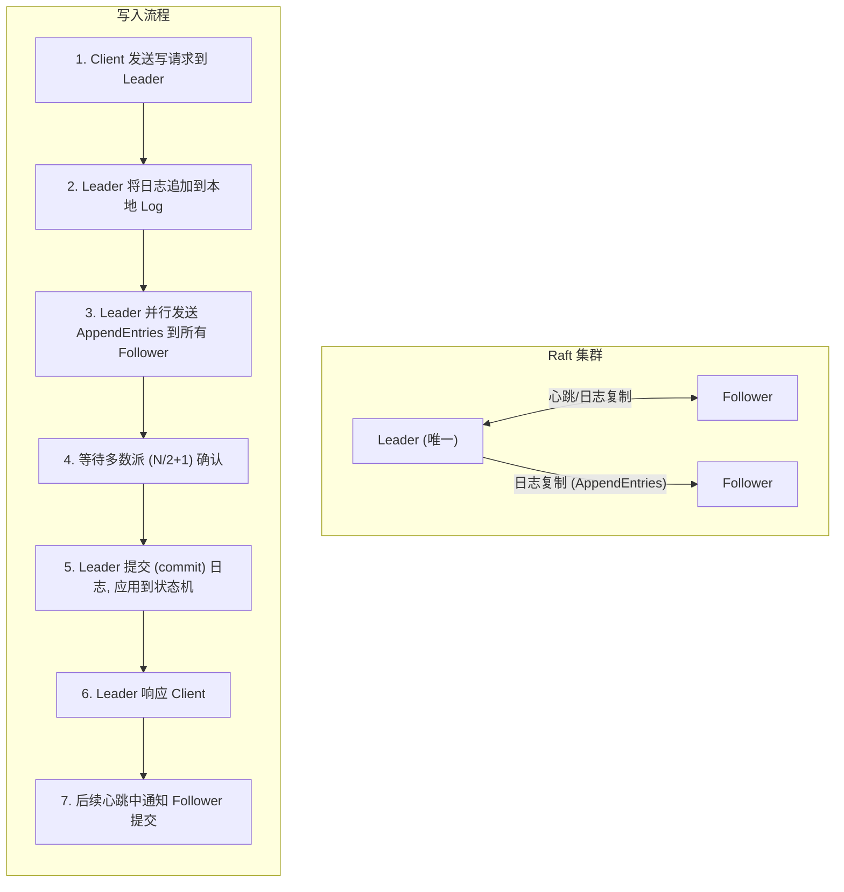

### 2.2 SOFAJRaft 核心组件

| 组件 | 说明 |
|------|------|
| **Node** | Raft 节点抽象，管理选举、日志复制、快照等 |
| **StateMachine** | 状态机接口，`onApply()` 应用已提交日志 |
| **RaftGroupService** | Raft Group 服务，管理一个 Raft Group 的生命周期 |
| **RpcServer** | RPC 服务器，处理节点间通信 (基于 gRPC) |
| **CliService** | 集群管理服务，处理成员变更等运维操作 |
| **RouteTable** | 路由表，缓存 Leader 信息 |
| **ReadIndex** | 线性一致性读实现 |

### 2.3 Leader 选举流程

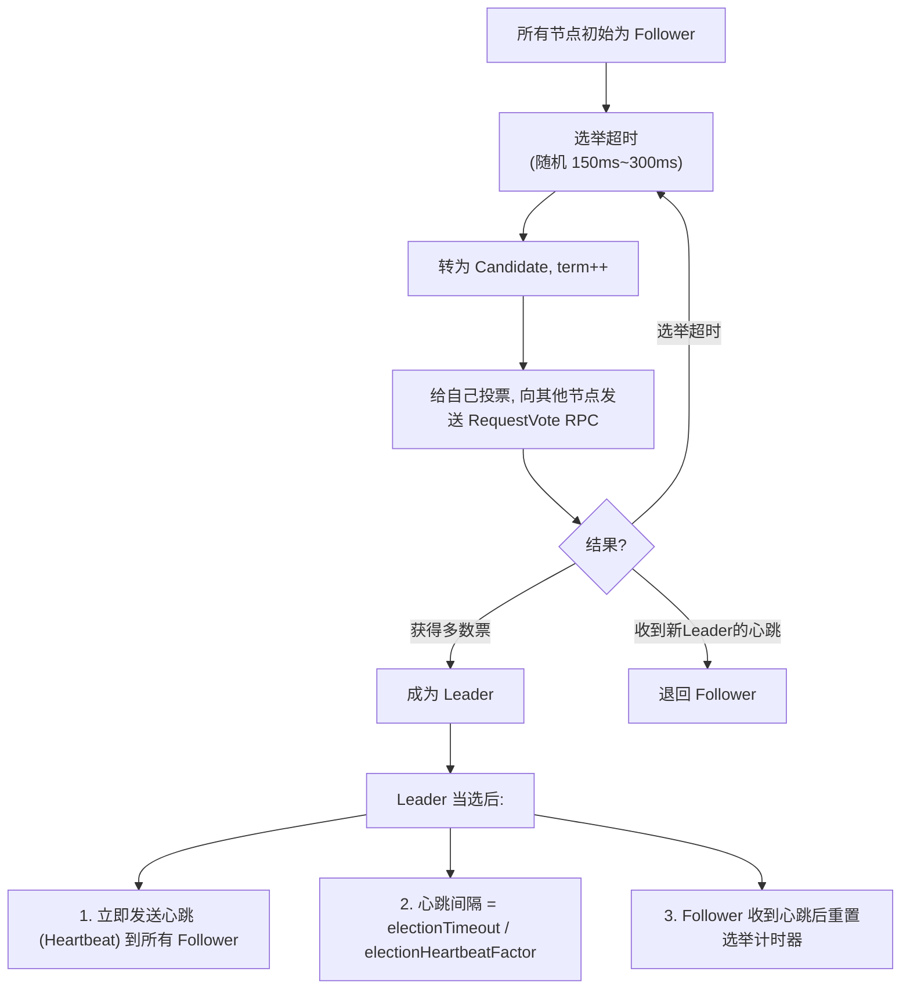

### 2.4 日志复制流程

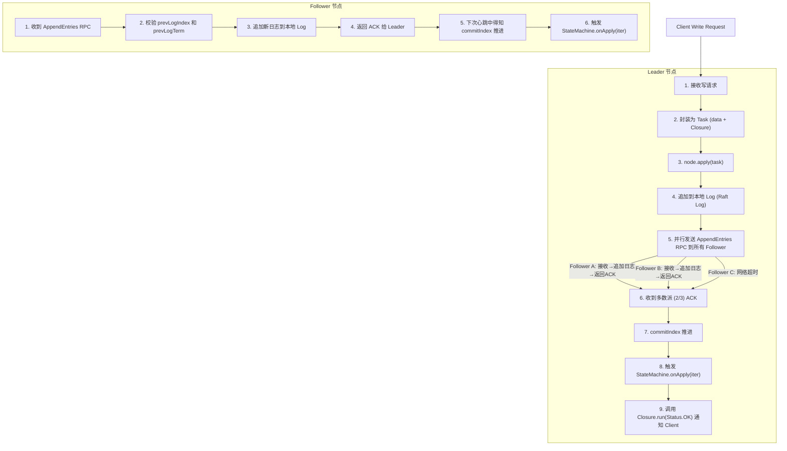

### 2.5 ReadIndex 线性一致性读

SOFAJRaft 的 ReadIndex 机制保证读操作读到的是**已经提交的最新数据**，而不是可能过期的本地数据：

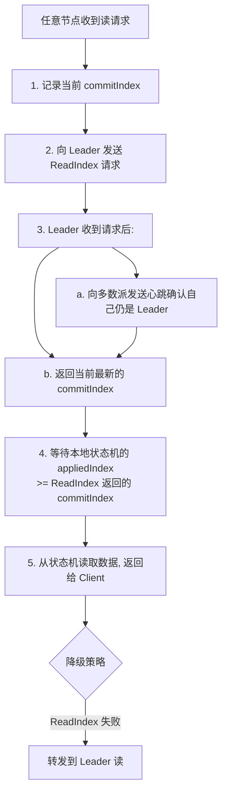

---

## 三、Nacos 整合 SOFAJRaft 的架构设计

### 3.1 整体分层架构

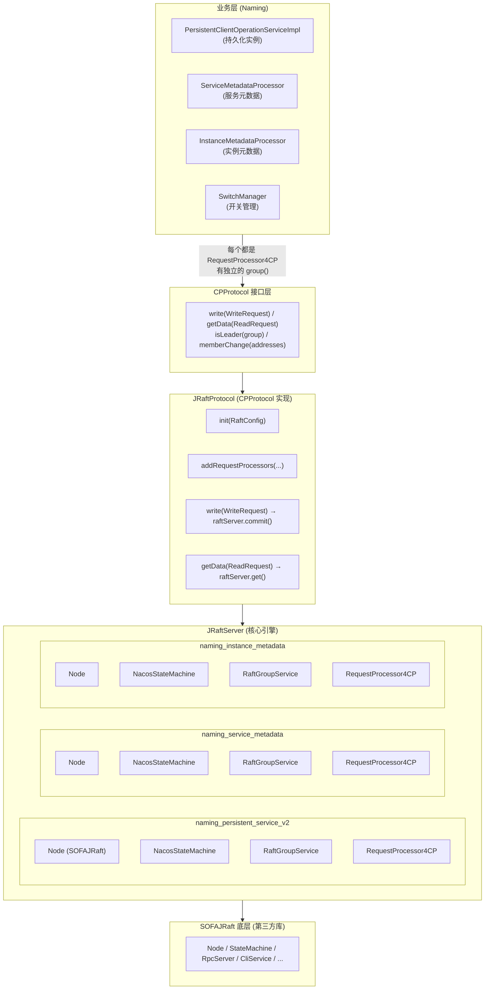

### 3.2 多 Raft Group 设计

Nacos 的核心设计是**每个业务模块拥有独立的 Raft Group**，每个 Group 有独立的状态机和日志存储：

```mermaid
flowchart TB
    subgraph Group1["Raft Group: naming_persistent_service_v2"]
        direction TB
        G1_Node["Node (Leader选举)"]
        G1_SM["StateMachine → PersistentClientOperationService"]
        G1_Log["Log Storage"]
        G1_Snap["Snapshot Storage"]
    end

    subgraph Group2["Raft Group: naming_service_metadata"]
        direction TB
        G2_Node["Node (Leader选举)"]
        G2_SM["StateMachine → ServiceMetadataProcessor"]
        G2_Log["Log Storage"]
        G2_Snap["Snapshot Storage"]
    end

    subgraph Group3["Raft Group: naming_instance_metadata"]
        direction TB
        G3_Node["Node (Leader选举)"]
        G3_SM["StateMachine → InstanceMetadataProcessor"]
        G3_Log["Log Storage"]
        G3_Snap["Snapshot Storage"]
    end

    subgraph Group4["Raft Group: naming_switch"]
        direction TB
        G4_Node["Node (Leader选举)"]
        G4_SM["StateMachine → SwitchManager"]
        G4_Log["Log Storage"]
        G4_Snap["Snapshot Storage"]
    end
```

**优势:**
1. 故障隔离: 一个 Group 异常不影响其他 Group
2. 独立选举: 每个 Group 可以有不同的 Leader
3. 独立快照: 每个 Group 独立做 Snapshot
4. 独立存储: 日志和快照文件物理隔离

---

## 四、初始化流程详解

### 4.1 启动时序图

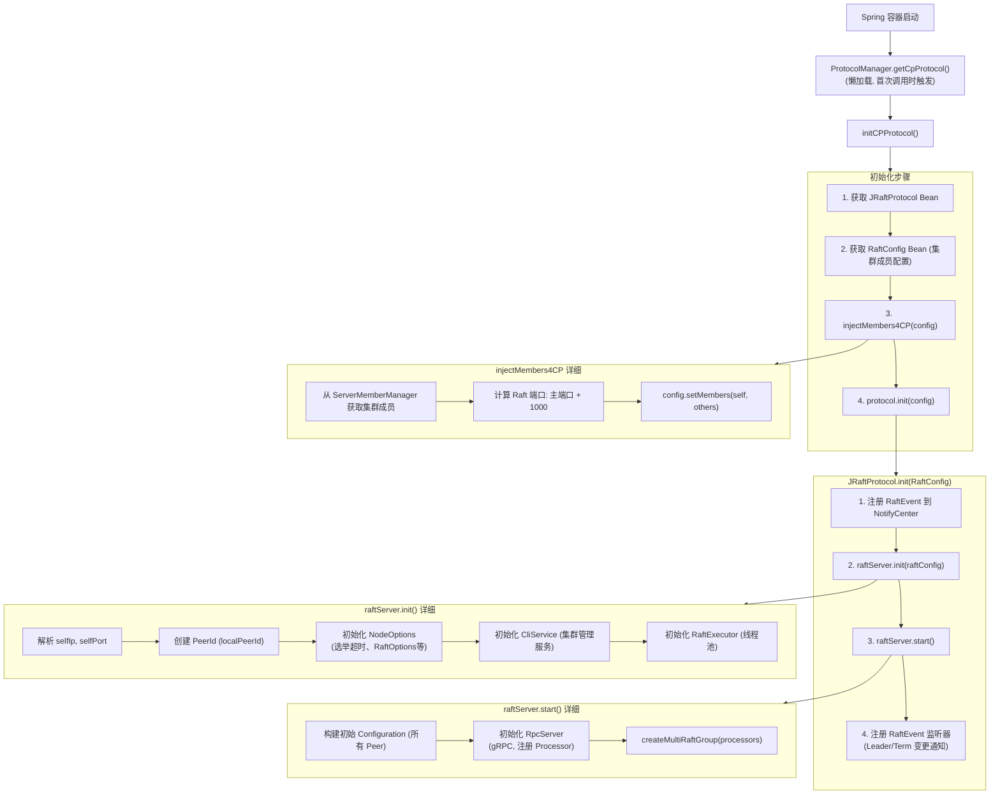

### 4.2 createMultiRaftGroup 详细流程

**源码位置**: [JRaftServer.java](file:///d:/workspace/java_projects/source_projects/nacos-2.4.1/core/src/main/java/com/alibaba/nacos/core/distributed/raft/JRaftServer.java#L225-L270)

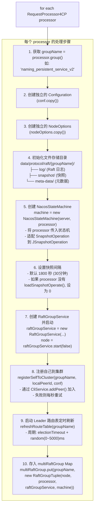

### 4.3 RPC 处理器注册

**源码位置**: [JRaftUtils.java](file:///d:/workspace/java_projects/source_projects/nacos-2.4.1/core/src/main/java/com/alibaba/nacos/core/distributed/raft/utils/JRaftUtils.java#L55-L80)

```java
// 在 JRaftUtils.initRpcServer() 中注册两类 RPC 处理器:
// 1. NacosWriteRequestProcessor - 处理写请求 (来自 Follower 转发)
// 2. NacosReadRequestProcessor  - 处理读请求 (来自 Follower 转发)

rpcServer.registerProcessor(new NacosWriteRequestProcessor(server, serializer));
rpcServer.registerProcessor(new NacosReadRequestProcessor(server, serializer));
```

---

## 五、写操作流程详解

### 5.1 写操作完整链路

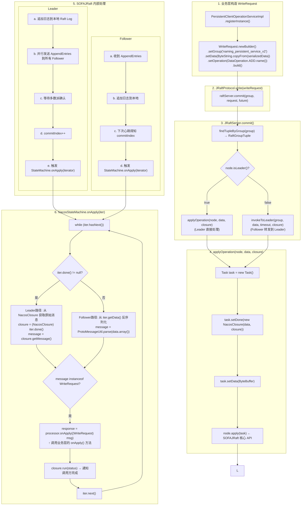

### 5.2 Follower 转发到 Leader 的流程

**源码位置**: [JRaftServer.java](file:///d:/workspace/java_projects/source_projects/nacos-2.4.1/core/src/main/java/com/alibaba/nacos/core/distributed/raft/JRaftServer.java#L390-L420)

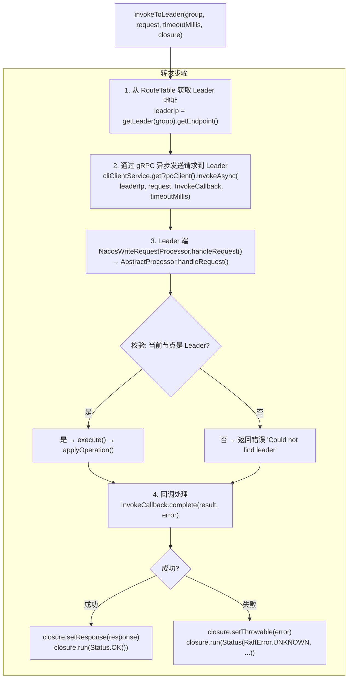

### 5.3 NacosClosure 回调机制

**源码位置**: [NacosClosure.java](file:///d:/workspace/java_projects/source_projects/nacos-2.4.1/core/src/main/java/com/alibaba/nacos/core/distributed/raft/NacosClosure.java)

```java
// NacosClosure 是 JRaft Closure 的包装, 用于在状态机 onApply 完成后回调
public class NacosClosure implements Closure {
    private Message message;       // 原始请求消息
    private Closure closure;       // 外层 Closure (FailoverClosureImpl)
    private NacosStatus nacosStatus; // 状态 + Response + Throwable

    @Override
    public void run(Status status) {
        nacosStatus.setStatus(status);
        closure.run(nacosStatus);  // 传递给外层 FailoverClosureImpl
    }
}

// FailoverClosureImpl 将结果设置到 CompletableFuture
public class FailoverClosureImpl implements FailoverClosure {
    private final CompletableFuture<Response> future;

    @Override
    public void run(Status status) {
        if (status.isOk()) {
            future.complete(data);  // 成功: 完成 Future
        } else {
            future.completeExceptionally(...);  // 失败: 异常完成
        }
    }
}
```

---

## 六、读操作流程详解

### 6.1 ReadIndex 线性一致性读

**源码位置**: [JRaftServer.java](file:///d:/workspace/java_projects/source_projects/nacos-2.4.1/core/src/main/java/com/alibaba/nacos/core/distributed/raft/JRaftServer.java#L280-L320)

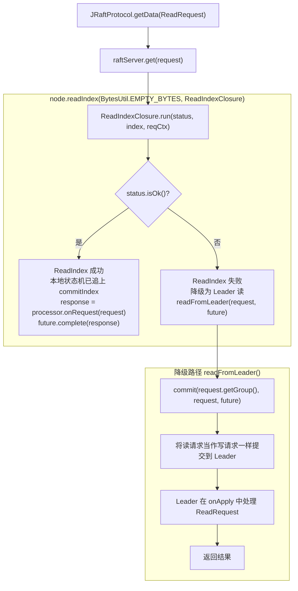

### 6.2 ReadOnlySafe 模式

**源码位置**: [RaftOptionsBuilder.java](file:///d:/workspace/java_projects/source_projects/nacos-2.4.1/core/src/main/java/com/alibaba/nacos/core/distributed/raft/utils/RaftOptionsBuilder.java#L60-L70)

```java
// 默认使用 ReadOnlySafe 模式
private static ReadOnlyOption raftReadIndexType(RaftConfig config) {
    String readOnySafe = "ReadOnlySafe";
    String type = config.getVal(RaftSysConstants.RAFT_READ_INDEX_TYPE);
    if (StringUtils.isBlank(type) || readOnySafe.equals(type)) {
        return ReadOnlyOption.ReadOnlySafe;
    }
    return ReadOnlyOption.ReadOnlyLeaseBased;
}
```

`ReadOnlySafe` 模式要求 Leader 在返回 ReadIndex 前向多数派确认自己仍是 Leader，保证读到的数据一定是最新已提交的。

---

## 七、快照 (Snapshot) 机制

### 7.1 快照的作用

1. **日志压缩**: Raft Log 无限增长会占用大量磁盘，快照将状态机当前状态持久化，之前的日志可以安全删除
2. **加速启动**: 新节点加入或节点重启时，直接从快照加载状态，无需重放所有历史日志
3. **Follower 追赶**: Follower 落后太多时，Leader 直接发送快照而非逐条日志

### 7.2 Nacos 快照架构

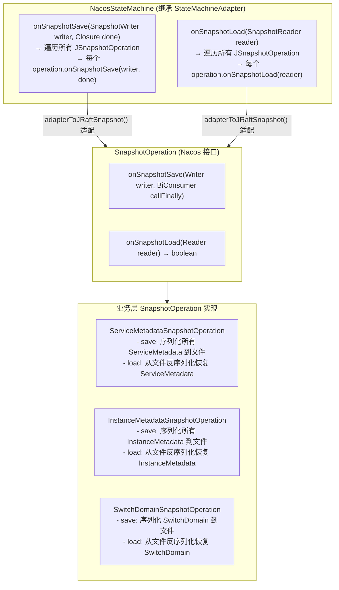

### 7.3 快照保存流程

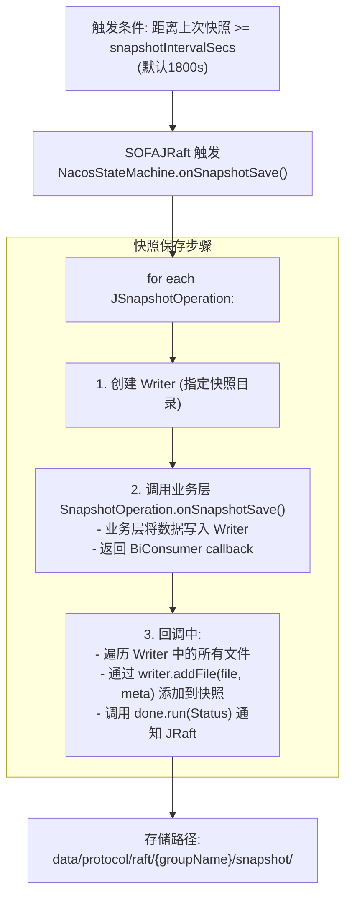

---

## 八、Leader 变更与元数据同步

### 8.1 RaftEvent 事件机制

**源码位置**: [NacosStateMachine.java](file:///d:/workspace/java_projects/source_projects/nacos-2.4.1/core/src/main/java/com/alibaba/nacos/core/distributed/raft/NacosStateMachine.java#L155-L195)

```java
// Leader 当选
@Override
public void onLeaderStart(final long term) {
    this.term = term;
    this.isLeader.set(true);
    this.leaderIp = node.getNodeId().getPeerId().getEndpoint().toString();
    NotifyCenter.publishEvent(
        RaftEvent.builder()
            .groupId(groupId)
            .leader(leaderIp)
            .term(term)
            .raftClusterInfo(allPeers())
            .build());
}

// 开始 Follow 新 Leader
@Override
public void onStartFollowing(LeaderChangeContext ctx) {
    this.term = ctx.getTerm();
    this.leaderIp = ctx.getLeaderId().getEndpoint().toString();
    NotifyCenter.publishEvent(
        RaftEvent.builder()
            .groupId(groupId)
            .leader(leaderIp)
            .term(ctx.getTerm())
            .raftClusterInfo(allPeers())
            .build());
}

// 配置变更 (成员变更)
@Override
public void onConfigurationCommitted(Configuration conf) {
    NotifyCenter.publishEvent(
        RaftEvent.builder()
            .groupId(groupId)
            .raftClusterInfo(JRaftUtils.toStrings(conf.getPeers()))
            .build());
}
```

### 8.2 元数据注入到 Member

**源码位置**: [JRaftProtocol.java](file:///d:/workspace/java_projects/source_projects/nacos-2.4.1/core/src/main/java/com/alibaba/nacos/core/distributed/raft/JRaftProtocol.java#L105-L145)

```java
// RaftEvent 监听器将 Leader/Term 信息注入到节点元数据
NotifyCenter.registerSubscriber(new Subscriber<RaftEvent>() {
    @Override
    public void onEvent(RaftEvent event) {
        Map<String, Object> properties = new HashMap<>();
        properties.put(MetadataKey.LEADER_META_DATA, event.getLeader());
        properties.put(MetadataKey.TERM_META_DATA, event.getTerm());
        properties.put(MetadataKey.RAFT_GROUP_MEMBER, event.getRaftClusterInfo());
        
        metaData.load(value);
        injectProtocolMetaData(metaData);
    }
});

// 将元数据注入到 Member 对象的 extendVal 中
private void injectProtocolMetaData(ProtocolMetaData metaData) {
    Member member = memberManager.getSelf();
    member.setExtendVal("raftMetaData", metaData);
    memberManager.update(member);
}
```

---

## 九、集群成员变更

### 9.1 节点加入

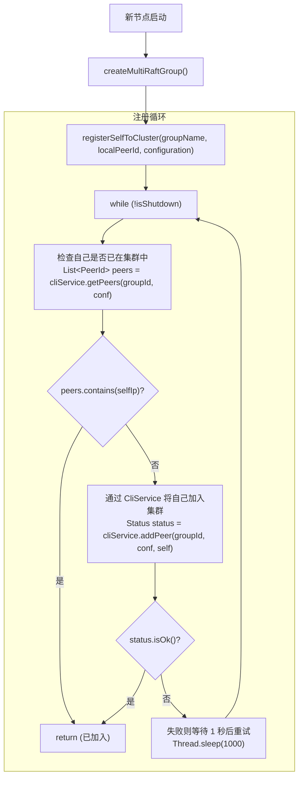

### 9.2 节点移除

**源码位置**: [JRaftServer.java](file:///d:/workspace/java_projects/source_projects/nacos-2.4.1/core/src/main/java/com/alibaba/nacos/core/distributed/raft/JRaftServer.java#L440-L480)

```java
boolean peerChange(JRaftMaintainService maintainService, Set<String> newPeers) {
    // 计算需要移除的节点
    Set<String> oldPeers = new HashSet<>(this.raftConfig.getMembers());
    oldPeers.removeAll(newPeers);
    
    // 遍历所有 Raft Group, 移除旧节点
    multiRaftGroup.forEach((groupName, tuple) -> {
        for (String peer : oldPeers) {
            cliService.removePeer(groupName, conf, peerId);
        }
    });
}
```

---

## 十、Naming 模块业务层整合

### 10.1 四个 RequestProcessor4CP 实现

| 类 | Raft Group | 职责 |
|----|-----------|------|
| [PersistentClientOperationServiceImpl](file:///d:/workspace/java_projects/source_projects/nacos-2.4.1/naming/src/main/java/com/alibaba/nacos/naming/core/v2/service/impl/PersistentClientOperationServiceImpl.java) | `naming_persistent_service_v2` | 持久化实例注册/注销/更新 |
| [ServiceMetadataProcessor](file:///d:/workspace/java_projects/source_projects/nacos-2.4.1/naming/src/main/java/com/alibaba/nacos/naming/core/v2/metadata/ServiceMetadataProcessor.java) | `naming_service_metadata` | 服务元数据增删改 |
| [InstanceMetadataProcessor](file:///d:/workspace/java_projects/source_projects/nacos-2.4.1/naming/src/main/java/com/alibaba/nacos/naming/core/v2/metadata/InstanceMetadataProcessor.java) | `naming_instance_metadata` | 实例元数据增删改 |
| [SwitchManager](file:///d:/workspace/java_projects/source_projects/nacos-2.4.1/naming/src/main/java/com/alibaba/nacos/naming/misc/SwitchManager.java) | `naming_switch` | 开关配置管理 |

### 10.2 持久化实例注册流程

**源码位置**: [PersistentClientOperationServiceImpl.java](file:///d:/workspace/java_projects/source_projects/nacos-2.4.1/naming/src/main/java/com/alibaba/nacos/naming/core/v2/service/impl/PersistentClientOperationServiceImpl.java#L105-L130)

```java
@Override
public void registerInstance(Service service, Instance instance, String clientId) {
    // 1. 校验: 不能对临时服务注册持久化实例
    if (singleton.isEphemeral()) {
        throw new NacosRuntimeException(...);
    }
    
    // 2. 构造请求
    InstanceStoreRequest request = new InstanceStoreRequest();
    request.setService(service);
    request.setInstance(instance);
    request.setClientId(clientId);
    
    // 3. 构造 WriteRequest
    WriteRequest writeRequest = WriteRequest.newBuilder()
        .setGroup(group())  // "naming_persistent_service_v2"
        .setData(ByteString.copyFrom(serializer.serialize(request)))
        .setOperation(DataOperation.ADD.name())
        .build();
    
    // 4. 通过 CP 协议写入 (同步等待 Raft 多数派确认)
    protocol.write(writeRequest);
}

// onApply 在所有节点上执行 (Leader + Follower)
@Override
public Response onApply(WriteRequest request) {
    readLock.lock();
    try {
        InstanceStoreRequest instanceRequest = serializer.deserialize(request.getData().toByteArray());
        DataOperation operation = DataOperation.valueOf(request.getOperation());
        switch (operation) {
            case ADD:
                onInstanceRegister(instanceRequest.service, instanceRequest.instance, instanceRequest.getClientId());
                break;
            case DELETE:
                onInstanceDeregister(instanceRequest.service, instanceRequest.getClientId());
                break;
            case CHANGE:
                if (instanceAndServiceExist(instanceRequest)) {
                    onInstanceRegister(instanceRequest.service, instanceRequest.instance, instanceRequest.getClientId());
                }
                break;
        }
        return Response.newBuilder().setSuccess(true).build();
    } finally {
        readLock.unlock();
    }
}
```

### 10.3 元数据处理流程

**源码位置**: [ServiceMetadataProcessor.java](file:///d:/workspace/java_projects/source_projects/nacos-2.4.1/naming/src/main/java/com/alibaba/nacos/naming/core/v2/metadata/ServiceMetadataProcessor.java#L80-L115)

```java
@Override
public Response onApply(WriteRequest request) {
    readLock.lock();
    try {
        // 反序列化元数据操作
        MetadataOperation<ServiceMetadata> op = serializer.deserialize(
            request.getData().toByteArray(), processType);
        
        switch (DataOperation.valueOf(request.getOperation())) {
            case ADD:
                addClusterMetadataToService(op);
                break;
            case CHANGE:
                updateServiceMetadata(op);
                break;
            case DELETE:
                deleteServiceMetadata(op);
                break;
        }
        return Response.newBuilder().setSuccess(true).build();
    } finally {
        readLock.unlock();
    }
}
```

---

## 十一、配置参数

**源码位置**: [RaftSysConstants.java](file:///d:/workspace/java_projects/source_projects/nacos-2.4.1/core/src/main/java/com/alibaba/nacos/core/distributed/raft/RaftSysConstants.java)

| 配置项 | 默认值 | 说明 |
|--------|--------|------|
| `nacos.core.protocol.raft.data.election_timeout_ms` | 5000ms | 选举超时 |
| `nacos.core.protocol.raft.data.snapshot_interval_secs` | 1800s (30分钟) | 快照间隔 |
| `nacos.core.protocol.raft.data.core_thread_num` | 8 | Raft 核心线程数 |
| `nacos.core.protocol.raft.data.cli_service_thread_num` | 4 | CLI 服务线程数 |
| `nacos.core.protocol.raft.data.read_index_type` | ReadOnlySafe | 读一致性模式 |
| `nacos.core.protocol.raft.data.rpc_request_timeout_ms` | 5000ms | RPC 请求超时 |
| `nacos.core.protocol.raft.data.max_byte_count_per_rpc` | 128KB | 单次 RPC 最大字节数 |
| `nacos.core.protocol.raft.data.max_entries_size` | 1024 | 单次最大日志条目数 |
| `nacos.core.protocol.raft.data.max_body_size` | 512KB | 单条日志最大 Body |
| `nacos.core.protocol.raft.data.max_append_buffer_size` | 256KB | 日志追加缓冲区 |
| `nacos.core.protocol.raft.data.max_election_delay_ms` | 1000ms | 选举随机延迟上限 |
| `nacos.core.protocol.raft.data.election_heartbeat_factor` | 10 | 心跳间隔因子 |
| `nacos.core.protocol.raft.data.apply_batch` | 32 | 批量应用大小 |
| `nacos.core.protocol.raft.data.sync` | true | 是否 fsync |
| `nacos.core.protocol.raft.data.sync_meta` | true | 元数据是否 fsync |

---

## 十二、关键设计总结

### 12.1 为什么选择 SOFAJRaft？

1. **蚂蚁金服生产验证**: 经历过蚂蚁内部大规模集群验证
2. **完整的 Raft 实现**: Leader 选举、日志复制、快照、成员变更、ReadIndex 等
3. **高性能**: 基于 Disruptor 的批处理、Pipeline 复制、gRPC 通信
4. **可观测性**: 内置 Metrics 指标

### 12.2 多 Raft Group 的优势

1. **故障隔离**: 持久化实例的 Raft Group 异常不影响元数据 Group
2. **独立选举**: 不同 Group 可以有不同 Leader，负载分散
3. **独立快照**: 每个 Group 独立做快照，避免互相影响
4. **独立存储**: 日志和快照文件按 Group 物理隔离

### 12.3 ReadIndex vs Leader 读

- **ReadIndex**: 任意节点可读，保证线性一致性，性能更好
- **Leader 读**: 降级策略，ReadIndex 失败时使用

### 12.4 写操作的同步等待

`protocol.write()` 通过 `CompletableFuture.get(10_000L, TimeUnit.MILLISECONDS)` 同步等待 Raft 多数派确认，最多等待 10 秒。

### 12.5 与 AP 协议的协作

`ProtocolManager` 同时管理 CP 和 AP 协议，通过 `MembersChangeEvent` 事件同步集群成员变更。业务层根据实例类型 (`ephemeral` vs `persistent`) 选择不同协议。

---

## 十三、核心源码文件索引

| 文件 | 路径 | 说明 |
|------|------|------|
| JRaftProtocol | `core/.../raft/JRaftProtocol.java` | CP 协议入口实现 |
| JRaftServer | `core/.../raft/JRaftServer.java` | Raft 服务器核心引擎 |
| NacosStateMachine | `core/.../raft/NacosStateMachine.java` | Raft 状态机实现 |
| NacosClosure | `core/.../raft/NacosClosure.java` | JRaft Closure 包装 |
| RaftConfig | `core/.../raft/RaftConfig.java` | Raft 配置 |
| RaftSysConstants | `core/.../raft/RaftSysConstants.java` | Raft 系统常量 |
| RaftEvent | `core/.../raft/RaftEvent.java` | Raft 事件 |
| JRaftMaintainService | `core/.../raft/JRaftMaintainService.java` | Raft 运维服务 |
| JRaftUtils | `core/.../raft/utils/JRaftUtils.java` | Raft 工具类 |
| RaftOptionsBuilder | `core/.../raft/utils/RaftOptionsBuilder.java` | RaftOptions 构建器 |
| RaftExecutor | `core/.../raft/utils/RaftExecutor.java` | Raft 线程池 |
| FailoverClosure | `core/.../raft/utils/FailoverClosure.java` | 失败回调接口 |
| FailoverClosureImpl | `core/.../raft/utils/FailoverClosureImpl.java` | 失败回调实现 |
| AbstractProcessor | `core/.../raft/processor/AbstractProcessor.java` | RPC 处理器抽象基类 |
| NacosWriteRequestProcessor | `core/.../raft/processor/NacosWriteRequestProcessor.java` | 写请求 RPC 处理器 |
| NacosReadRequestProcessor | `core/.../raft/processor/NacosReadRequestProcessor.java` | 读请求 RPC 处理器 |
| ProtocolManager | `core/.../distributed/ProtocolManager.java` | 协议管理器 |
| AbstractConsistencyProtocol | `core/.../distributed/AbstractConsistencyProtocol.java` | 一致性协议抽象基类 |
| CPProtocol | `consistency/.../cp/CPProtocol.java` | CP 协议接口 |
| RequestProcessor4CP | `consistency/.../cp/RequestProcessor4CP.java` | CP 请求处理器基类 |
| RequestProcessor | `consistency/.../RequestProcessor.java` | 请求处理器抽象类 |
| SnapshotOperation | `consistency/.../snapshot/SnapshotOperation.java` | 快照操作接口 |
| PersistentClientOperationServiceImpl | `naming/.../service/impl/PersistentClientOperationServiceImpl.java` | 持久化实例操作服务 |
| ServiceMetadataProcessor | `naming/.../metadata/ServiceMetadataProcessor.java` | 服务元数据处理器 |
| InstanceMetadataProcessor | `naming/.../metadata/InstanceMetadataProcessor.java` | 实例元数据处理器 |
| SwitchManager | `naming/.../misc/SwitchManager.java` | 开关管理器 |
